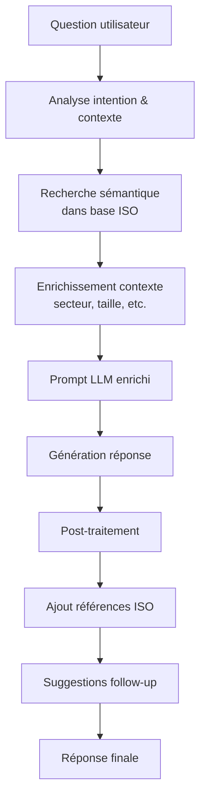
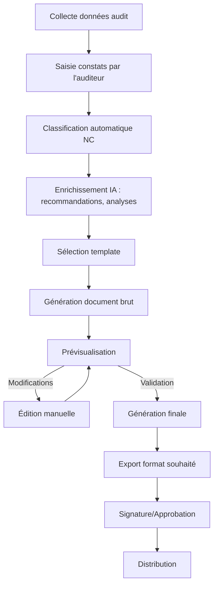
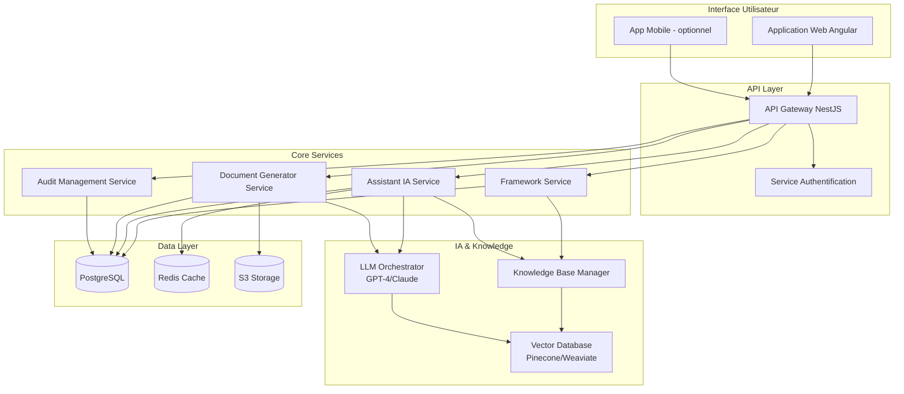

# Agent IA d'Audit ISO 9001 - Spécification Technique & Fonctionnelle

**Version**: 1.0  
**Date**: 27 janvier 2026  
**Status**: Spécification Détaillée

---

## 1. Executive Summary

### 1.1 Aperçu du Projet

L'Agent IA d'Audit ISO 9001 est un assistant intelligent spécialisé qui accompagne les auditeurs qualité tout au long du cycle de vie d'un audit de certification ISO 9001:2015. Il combine une base de connaissances exhaustive de la norme, des capacités d'analyse documentaire, et des fonctionnalités de génération de rapports pour créer un écosystème complet d'aide à l'audit.

**Objectifs principaux** :
- Structurer et standardiser le processus d'audit ISO 9001
- Réduire le temps de préparation et de rédaction des audits de 40-60%
- Garantir la couverture exhaustive de tous les chapitres de la norme
- Faciliter la traçabilité des preuves et non-conformités
- Générer automatiquement des rapports professionnels

### 1.2 Audience Cible

**Utilisateurs primaires** :
- Auditeurs ISO 9001 certifiés (internes et externes)
- Responsables qualité et QSE
- Consultants en management de la qualité
- Organismes de certification

**Utilisateurs secondaires** :
- Entreprises en préparation de certification
- Responsables de processus métier
- Directions générales cherchant à comprendre les exigences ISO

### 1.3 Proposition de Valeur

**Pour l'auditeur** :
- Guide pas-à-pas pour chaque phase d'audit
- Suggestions contextuelles de questions et points de contrôle
- Génération automatique de documents (plans d'audit, rapports, fiches de NC)
- Base de connaissances accessible instantanément

**Pour l'entreprise auditée** :
- Rapports clairs et actionnables
- Recommandations personnalisées selon le contexte
- Feuilles de route pour la mise en conformité
- Suivi transparent des non-conformités

**Pour l'organisation** :
- Standardisation des pratiques d'audit
- Traçabilité complète des audits
- Analytics et tendances qualité
- Capitalisation des connaissances métier

### 1.4 Critères de Succès

- **Adoption** : >80% des auditeurs utilisent l'agent pour leurs audits dans les 6 mois
- **Efficacité** : Réduction de 50% du temps de rédaction des rapports d'audit
- **Qualité** : Couverture à 100% des exigences normatives dans chaque audit
- **Satisfaction** : Score NPS >70 auprès des auditeurs et des audités
- **Conformité** : 0 écart de conformité dans les audits réalisés avec l'agent

---

## 2. Vue d'Ensemble des Fonctionnalités

L'agent IA couvre **trois axes majeurs** :

**1. Framework d'Audit Structuré** - Exposition complète de la structure ISO 9001 avec tous les points de contrôle, preuves requises, et documents attendus

**2. Assistant Conversationnel Intelligent** - Système de Q&A pour interroger l'agent sur la norme, les méthodes d'audit, ou un contexte client spécifique

**3. Générateur de Rapports et Documents** - Automatisation de la génération de tous les documents d'audit (plans, rapports, fiches de NC, recommandations)

Ces trois piliers sont **interconnectés** : le framework nourrit l'assistant conversationnel qui lui-même facilite la génération des rapports.

---

## 3. Fonctionnalité 1 : Framework d'Audit Structuré ISO 9001

### 3.1 Vue d'Ensemble

Le Framework d'Audit Structure constitue le **socle de connaissances** de l'agent. Il expose de manière exhaustive et structurée tous les éléments nécessaires pour conduire un audit ISO 9001:2015 complet.

### 3.2 Structure du Framework

Le framework est organisé selon **7 chapitres auditables** de la norme ISO 9001:2015 :

- **Chapitre 4** - Contexte de l'organisation
- **Chapitre 5** - Leadership  
- **Chapitre 6** - Planification
- **Chapitre 7** - Support
- **Chapitre 8** - Réalisation des activités opérationnelles
- **Chapitre 9** - Évaluation des performances
- **Chapitre 10** - Amélioration

Pour **chaque chapitre**, le framework expose :

1. **Exigences détaillées** - Texte de la norme et interprétation
2. **Points de contrôle** - Ce que l'auditeur doit vérifier concrètement
3. **Preuves attendues** - Enregistrements et données probantes
4. **Documents associés** - Procédures, instructions, formulaires typiques
5. **Non-conformités fréquentes** - Écarts typiquement observés
6. **Questions d'audit suggérées** - Questions types pour interroger l'audité
7. **Particularités sectorielles** - Spécificités selon les secteurs (industrie, services, santé, IT, etc.)

### 3.3 Exemple Détaillé : Chapitre 7.2 - Compétences

#### 7.2 Compétences

**Exigences normatives** (ISO 9001:2015, §7.2) :
> L'organisme doit :
> - Déterminer les compétences nécessaires des personnes effectuant un travail ayant une incidence sur les performances et l'efficacité du SMQ
> - Assurer que ces personnes sont compétentes sur la base d'une formation initiale ou professionnelle ou d'une expérience appropriées
> - Le cas échéant, entreprendre des actions pour acquérir les compétences nécessaires et évaluer l'efficacité de ces actions
> - Conserver des informations documentées appropriées comme preuves de compétence

**Interprétation** :
L'organisme doit identifier les compétences requises pour chaque poste ou fonction ayant un impact sur la qualité, puis s'assurer que le personnel possède effectivement ces compétences (diplômes, formations, expérience). Si des écarts existent, des formations ou d'autres actions doivent être mises en place, et leur efficacité doit être mesurée. Enfin, toutes les preuves de compétence doivent être conservées dans des dossiers individuels.

**Points de contrôle** :
- ✅ Compétences requises sont définies pour chaque poste (fiches de fonction, référentiels métier)
- ✅ Évaluation initiale des compétences du personnel (matrice de compétences requis vs acquis)
- ✅ Plans de formation ou d'acquisition de compétences définis pour combler les écarts
- ✅ Formations réalisées et traçables (calendrier, feuilles de présence)
- ✅ Évaluation de l'efficacité des formations (évaluation à chaud, à froid, mise en pratique)
- ✅ Dossiers individuels de compétences conservés et accessibles
- ✅ Processus de maintien et développement des compétences (formation continue)

**Preuves attendues** :
- 📄 **Fiches de fonction** ou descriptions de poste mentionnant les compétences requises
- 📄 **Matrice de compétences** (tableau croisant personnel / compétences requises / compétences acquises)
- 📄 **Plan de formation annuel** (besoins identifiés, formations planifiées, budget)
- 📄 **Attestations de formation**, certificats, diplômes
- 📄 **Évaluations post-formation** (questionnaires satisfaction, évaluations pratiques)
- 📄 **Dossiers individuels** de chaque collaborateur avec CV, diplômes, formations suivies
- 📄 **Habilitations spécifiques** si applicable (habilitations électriques, CACES, soudage, etc.)

**Documents associés typiques** :
- Procédure de gestion des compétences
- Fiches de poste / Référentiels de compétences
- Plan de développement des compétences (ex-plan de formation)
- Catalogue de formations
- Feuilles d'émargement
- Questionnaires d'évaluation de formation
- Entretiens annuels d'évaluation
- Matrice GPEC (Gestion Prévisionnelle des Emplois et Compétences)

**Non-conformités fréquentes** :

| Type | Description | Fréquence | Gravité |
|------|-------------|-----------|---------|
| NC Mineure | Preuves de compétence manquantes pour certains postes (diplômes ou attestations non archivés) | ⭐⭐⭐ Élevée | Mineure |
| NC Mineure | Absence d'évaluation de l'efficacité des formations réalisées | ⭐⭐ Moyenne | Mineure |
| NC Majeure | Compétences requises non définies pour des postes critiques (ex: soudeurs, contrôleurs qualité) | ⭐ Faible | Majeure |
| NC Mineure | Matrice de compétences non à jour ou incomplète | ⭐⭐ Moyenne | Mineure |
| Observation | Plan de formation peu formalisé ou non aligné avec les besoins identifiés | ⭐⭐ Moyenne | Observation |

**Questions d'audit suggérées** :

*Questions à la Direction / RRH :*
- Comment déterminez-vous les compétences nécessaires pour chaque poste dans l'entreprise ?
- Pouvez-vous me montrer la matrice de compétences de votre organisation ?
- Comment identifiez-vous les besoins en formation de vos collaborateurs ?
- Quelle est votre méthodologie pour évaluer l'efficacité d'une formation ?
- Comment gérez-vous les compétences critiques et leur transmission (départs, retraites) ?

*Questions aux opérationnels :*
- Avez-vous reçu une formation pour occuper ce poste ? Pouvez-vous me la décrire ?
- Vous sentez-vous compétent pour réaliser les tâches qui vous sont confiées ?
- Participez-vous régulièrement à des formations ? Lesquelles récemment ?
- Comment votre manager s'assure-t-il que vous maîtrisez bien votre poste ?

*Questions de vérification documentaire :*
- Puis-je consulter le dossier de compétences de M./Mme X ?
- Pouvez-vous me montrer les attestations de formation des opérateurs sur ligne de production ?
- Le plan de formation de cette année a-t-il été établi ? Sur quels critères ?
- Comment traçez-vous les formations obligatoires (sécurité, réglementaires) ?

**Particularités sectorielles** :

**Industrie automobile (IATF 16949)** :
- Qualifications spécifiques obligatoires pour certains postes (soudeurs, contrôleurs CND, auditeurs internes)
- Matrices de compétences très détaillées et formalisées
- Formation à la détection des défauts critiques
- Qualification interne des opérateurs souvent requise avant affectation à un poste

**Aéronautique (EN 9100)** :
- Personnel d'inspection et de test qualifié et certifié
- Traçabilité stricte des habilitations (dates de validité)
- Formation continue obligatoire
- Sensibilisation FOD (Foreign Object Debris) systématique

**Dispositifs médicaux (ISO 13485)** :
- Compétences documentées pour tout personnel affectant la qualité du produit
- Formation à l'hygiène et à la contamination
- Sensibilisation aux risques patients

**Services IT / Logiciel** :
- Certifications techniques (AWS, Azure, Scrum, ITIL, etc.)
- Compétences en cybersécurité et protection des données
- Veille technologique et formation continue cruciales

**Santé (certification HAS, ISO 9001 santé)** :
- Diplômes d'État obligatoires (médecins, infirmiers, etc.)
- DPC (Développement Professionnel Continu) obligatoire
- Habilitations spécifiques (radioprotection, hygiène, etc.)

**Exemples de preuves concrètes par secteur** :
- **Automobile** : Certificats de qualification soudure (EN ISO 9606), habilitations CND, matrices de polyvalence opérateurs
- **Aéronautique** : Cartes d'habilitation FOD, qualifications contrôleurs, certifications EN 4179
- **IT** : Certifications AWS Solutions Architect, Scrum Master, CISSP, etc.
- **Santé** : Diplômes d'État, attestations DPC, formations obligatoires (gestes d'urgence, hygiène)

---

### 3.4 Vue Exhaustive des Chapitres ISO 9001

> **Note** : Le contenu ci-dessous présente la structure complète des 7 chapitres auditables. Pour chacun, l'agent possède le même niveau de détail que l'exemple 7.2 ci-dessus (exigences, points de contrôle, preuves, questions, NC fréquentes, particularités sectorielles).

#### Chapitre 4 - Contexte de l'organisation

**Sous-chapitres** :
- 4.1 Compréhension de l'organisation et de son contexte
- 4.2 Compréhension des besoins et attentes des parties intéressées
- 4.3 Détermination du domaine d'application du SMQ
- 4.4 Système de management de la qualité et ses processus

**Documents clés** :
- Analyse SWOT, PESTEL, ou analyse stratégique
- Matrice des parties intéressées
- Document de périmètre du SMQ
- Cartographie des processus
- Fiches de processus (SIPOC, fiches détaillées)

**NC fréquentes** :
- Analyse du contexte trop générique ou non mise à jour
- Parties intéressées non exhaustives (oubli de certaines catégories)
- Périmètre du SMQ flou ou non documenté
- Cartographie des processus incomplète ou déconnectée de la réalité
- Interactions entre processus non clairement établies

---

#### Chapitre 5 - Leadership

**Sous-chapitres** :
- 5.1 Leadership et engagement (5.1.1 Généralités, 5.1.2 Orientation client)
- 5.2 Politique (5.2.1 Établissement, 5.2.2 Communication)
- 5.3 Rôles, responsabilités et autorités organisationnelles

**Documents clés** :
- Comptes-rendus de CODIR/COMEX mentionnant la qualité
- Comptes-rendus de revue de direction
- Politique qualité signée et datée
- Organigramme avec responsabilités qualité
- Fiches de fonction
- Lettre de mission du responsable qualité

**NC fréquentes** :
- Implication insuffisante de la direction (absence aux revues de direction)
- Politique qualité générique, non adaptée au contexte de l'entreprise
- Politique qualité peu communiquée ou inconnue du personnel
- Responsabilités qualité floues ou non formalisées
- Responsable SMQ sans autorité claire

---

#### Chapitre 6 - Planification

**Sous-chapitres** :
- 6.1 Actions à mettre en œuvre face aux risques et opportunités
- 6.2 Objectifs qualité et planification pour les atteindre
- 6.3 Planification des modifications

**Documents clés** :
- Registre des risques et opportunités
- Cartographie des risques
- Procédure de gestion des risques
- Tableau des objectifs qualité
- Plans d'action pour atteindre les objectifs
- Tableaux de bord de suivi
- Procédure de gestion des modifications

**NC fréquentes** :
- Analyse des risques trop sommaire ou non exhaustive
- Risques identifiés mais pas de plans d'action associés
- Objectifs qualité non mesurables (pas de critère SMART)
- Objectifs non communiqués aux équipes concernées
- Absence de suivi régulier de l'atteinte des objectifs
- Modifications du SMQ non maîtrisées (changements sans analyse d'impact)

---

#### Chapitre 7 - Support

**Sous-chapitres** :
- 7.1 Ressources (7.1.1 à 7.1.6 : généralités, ressources humaines, infrastructure, environnement, surveillance et mesure, connaissances)
- 7.2 Compétences
- 7.3 Sensibilisation
- 7.4 Communication
- 7.5 Informations documentées (7.5.1 Généralités, 7.5.2 Création et mise à jour, 7.5.3 Maîtrise)

**Documents clés** :
- Budget qualité
- Inventaire des équipements et infrastructures
- Plans de maintenance
- Plan d'étalonnage, certificats d'étalonnage
- Fiches de fonction, matrice de compétences
- Plan de formation
- Attestations de formation
- Supports de sensibilisation
- Plan de communication
- Manuel qualité ou document équivalent
- Procédures documentées
- Procédure de gestion documentaire
- Tableau de gestion (durées de conservation)

**NC fréquentes** :
- Ressources insuffisantes pour tenir le SMQ (budget, personnel)
- Équipements de mesure non étalonnés ou étalonnage en retard
- Preuves de compétence manquantes (voir détail 7.2 ci-dessus)
- Sensibilisation du personnel insuffisante (politique/objectifs méconnus)
- Gestion documentaire chaotique (versions obsolètes non retirées, documents non maîtrisés)
- Documents obligatoires manquants

---

#### Chapitre 8 - Réalisation des activités opérationnelles

**Sous-chapitres** :
- 8.1 Planification et maîtrise opérationnelles
- 8.2 Exigences relatives aux produits et services (8.2.1 à 8.2.4)
- 8.3 Conception et développement (8.3.1 à 8.3.6) - *si applicable*
- 8.4 Maîtrise des processus, produits et services fournis par des prestataires externes (8.4.1 à 8.4.3)
- 8.5 Production et prestation de service (8.5.1 à 8.5.6)
- 8.6 Libération des produits et services
- 8.7 Maîtrise des éléments de sortie non conformes

**Documents clés** :
- Modes opératoires, instructions de travail
- Plans de surveillance et de contrôle
- Plans qualité (pour projets complexes)
- Procédure de gestion commerciale / commandes
- Fiches de revue de commande
- Contrats, bons de commande
- Cahiers des charges
- Dossiers de conception (si applicable)
- Rapports de tests, validations
- Procédure de gestion des fournisseurs
- Évaluations fournisseurs
- Contrats fournisseurs, cahiers des charges achats
- Enregistrements de contrôles
- Certificats de conformité, bons de livraison
- Procédure de gestion des non-conformités
- Fiches de non-conformité
- Demandes de dérogation

**NC fréquentes** :
- Revue de commande non systématique ou incomplète
- Exigences client mal identifiées ou non documentées
- Conception : absence de validation ou vérification
- Fournisseurs non évalués ou évaluation non formalisée
- Absence de critères d'acceptation fournisseurs
- Contrôles en production non définis ou non réalisés
- Produits non conformes livrés (absence de maîtrise)
- Traçabilité insuffisante ou inexistante
- Non-conformités non enregistrées ou mal traitées

---

#### Chapitre 9 - Évaluation des performances

**Sous-chapitres** :
- 9.1 Surveillance, mesure, analyse et évaluation (9.1.1 Généralités, 9.1.2 Satisfaction du client, 9.1.3 Analyse et évaluation)
- 9.2 Audit interne
- 9.3 Revue de direction (9.3.1 Généralités, 9.3.2 Éléments d'entrée, 9.3.3 Éléments de sortie)

**Documents clés** :
- Tableaux de bord qualité (indicateurs)
- Enquêtes de satisfaction client
- Rapports d'analyse de données
- Procédure d'audit interne
- Programme d'audit annuel
- Rapports d'audit interne
- Plans d'action suite à audits
- Procédure de revue de direction
- Dossier de revue de direction (éléments d'entrée)
- Compte-rendu de revue de direction (éléments de sortie, décisions)

**NC fréquentes** :
- Indicateurs de performance non définis ou non suivis
- Satisfaction client non mesurée ou mesure trop rare
- Analyses de données inexistantes ou superficielles
- Pas d'audits internes réalisés ou programme non respecté
- Auditeurs internes non formés ou non indépendants
- Couverture incomplète des processus par les audits
- Actions correctives suite à audit non suivies
- Revue de direction non réalisée ou incomplète (éléments d'entrée manquants)
- Pas de décisions/actions en sortie de revue de direction
- Revue de direction >12 mois (NC majeure)

---

#### Chapitre 10 - Amélioration

**Sous-chapitres** :
- 10.1 Généralités
- 10.2 Non-conformité et actions correctives
- 10.3 Amélioration continue

**Documents clés** :
- Procédure d'amélioration continue
- Registre des opportunités d'amélioration
- Fiches de projets d'amélioration (Kaizen, 5S, Lean, etc.)
- Procédure de gestion des non-conformités et actions correctives
- Fiches de non-conformité
- Analyses de causes (5 Pourquoi, Ishikawa, etc.)
- Fiches d'actions correctives
- Évaluations de l'efficacité des actions

**NC fréquentes** :
- Absence de démarche d'amélioration continue structurée
- Non-conformités non enregistrées ou mal documentées
- Analyse des causes superficielle ou absente
- Actions correctives non définies ou non suivies
- Efficacité des actions correctives non vérifiée
- Récurrence de mêmes non-conformités (actions inefficaces)
- Pas de culture de l'amélioration continue dans l'entreprise

---

### 3.5 Fonctionnalités du Framework

**F-1.1 : Navigation par chapitre**
- L'utilisateur peut parcourir le framework chapitre par chapitre
- Affichage hiérarchique : Chapitre > Sous-chapitre > Exigence > Points de contrôle

**F-1.2 : Recherche par mot-clé**
- Recherche plein texte dans tout le framework
- Résultats classés par pertinence
- Highlighting des termes recherchés

**F-1.3 : Filtrage contextuel**
- Filtrer par secteur d'activité (affiche uniquement les particularités sectorielles pertinentes)
- Filtrer par taille d'entreprise (TPE, PME, ETI, GE)
- Filtrer par type de processus (production, services, conception, etc.)

**F-1.4 : Génération de checklists personnalisées**
- Sélection des chapitres à inclure
- Export PDF ou Excel
- Checklist avec cases à cocher pour chaque point de contrôle

**F-1.5 : Mode "Préparation d'audit"**
- Vue synthétique par processus métier (achats, production, RH, etc.)
- Mapping automatique processus → chapitres ISO concernés
- Suggestion de durée d'audit par processus

**F-1.6 : Base de connaissances enrichie**
- Liens vers ressources externes (guides ISO, FAQ officielles, jurisprudence de certification)
- Exemples concrets de preuves (photos, documents anonymisés)
- Vidéos explicatives pour concepts complexes (si disponibles)

---

### 3.6 Acceptance Criteria

✅ L'agent expose les 7 chapitres auditables (4 à 10) de la norme ISO 9001:2015 de manière exhaustive

✅ Pour chaque chapitre : exigences détaillées, points de contrôle, preuves attendues, documents associés, NC fréquentes, questions d'audit, particularités sectorielles

✅ Navigation intuitive et fluide entre chapitres, sous-chapitres, et exigences

✅ Recherche plein texte fonctionnelle avec résultats pertinents en <1 seconde

✅ Filtrage par secteur, taille d'entreprise, type de processus opérationnel

✅ Génération de checklists personnalisées téléchargeables (PDF, Excel)

✅ Mapping entre processus métier et chapitres ISO

✅ Temps de chargement du framework <2 secondes

✅ Base de connaissances mise à jour régulièrement (veille normative, retours terrain)

---

### 3.7 User Stories

**US-1.1 : En tant qu'auditeur débutant**
- Je veux parcourir le chapitre 7 (Support) du framework
- Pour que je comprenne toutes les exigences relatives aux compétences, ressources, et documentation
- Et que je puisse préparer mes questions d'audit

**US-1.2 : En tant qu'auditeur expérimenté**
- Je veux filtrer le framework pour une entreprise industrielle de 150 personnes avec activité de conception
- Pour que l'agent me montre uniquement les particularités sectorielles de l'industrie et les exigences du chapitre 8.3
- Et que je gagne du temps dans ma préparation

**US-1.3 : En tant que responsable qualité**
- Je veux générer une checklist pour un auto-audit interne couvrant les chapitres 4, 5, 6, 9, 10
- Pour que mon équipe puisse vérifier notre conformité avant l'audit de certification
- Et que nous identifions les écarts en amont

**US-1.4 : En tant que consultant**
- Je veux rechercher "étalonnage" dans le framework
- Pour que l'agent me renvoie toutes les exigences liées (7.1.5.2 principalement)
- Et que je puisse conseiller mon client sur les preuves à fournir

**US-1.5 : En tant qu'auditeur d'organisme certificateur**
- Je veux voir la liste des NC fréquentes pour le chapitre 9.2 (Audits internes)
- Pour que je sois vigilant sur ces points lors de mon audit
- Et que je vérifie en priorité les zones à risque

---

## 4. Fonctionnalité 2 : Assistant Conversationnel Intelligent

### 4.1 Vue d'Ensemble

L'Assistant Conversationnel est le **cœur interactif** de l'agent. Il permet à l'utilisateur d'interroger l'agent sur n'importe quel aspect de la norme ISO 9001, des méthodes d'audit, ou d'un contexte client spécifique.

L'assistant utilise un **LLM avancé** (GPT-4 ou Claude Opus) enrichi par la base de connaissances ISO 9001 pour fournir des réponses précises, contextualisées, et sourcées.

### 4.2 Capacités de l'Assistant

**Domaines de connaissance** :
- ✅ Norme ISO 9001:2015 dans son intégralité (texte, interprétation, exemples)
- ✅ Méthodologie d'audit (planification, réalisation, rapport, suivi)
- ✅ Classification des non-conformités (critères, exemples)
- ✅ Bonnes pratiques sectorielles (industrie, services, santé, IT, etc.)
- ✅ Documents et preuves attendus par exigence
- ✅ Différences entre ISO 9001:2015 et version 2008
- ✅ Liens avec autres référentiels (IATF 16949, ISO 13485, EN 9100, etc.)
- ✅ Retours d'expérience et cas pratiques

**Types de questions supportées** :
1. **Questions factuelles** : "Quels sont les documents obligatoires en ISO 9001 ?"
2. **Questions d'interprétation** : "Comment appliquer la clause 8.3 dans une ESN ?"
3. **Questions de comparaison** : "Quelle différence entre NC majeure et mineure ?"
4. **Questions méthodologiques** : "Comment structurer un audit de 2 jours ?"
5. **Questions de dépannage** : "Mon client n'a pas de politique qualité, comment l'aider ?"
6. **Questions contextuelles** : "Pour une TPE de 10 personnes, quel niveau de doc ?"

### 4.3 Fonctionnement



### 4.4 Structure des Réponses

Chaque réponse de l'assistant est structurée de manière cohérente :

```markdown
[Réponse principale - paragraphe(s) explicatif(s)]

**Référence ISO 9001:2015** : [Chapitre X.X - Titre]

**Exemple concret** :
[Illustration pratique de l'explication]

**Pour aller plus loin** :
- [Question de suivi 1]
- [Question de suivi 2]
- [Question de suivi 3]
```

**Exemple** :

Question : *"Quelle est la différence entre une NC majeure et une NC mineure ?"*

Réponse :
```
Une non-conformité (NC) est un non-respect d'une exigence de la norme ISO 9001. 
La classification en NC majeure ou mineure dépend de la gravité et de l'étendue 
de l'écart.

**NC Majeure** :
Une NC majeure se caractérise par :
- L'absence totale ou quasi-totale d'application d'une exigence de la norme
- Un non-respect systématique d'une exigence
- Un risque important pour la conformité du produit/service ou la satisfaction client
- Une situation compromettant l'intégrité du SMQ

Exemples :
- Absence de revue de direction depuis plus de 12 mois
- Pas d'audits internes réalisés depuis la dernière certification
- Produits non conformes régulièrement livrés sans maîtrise
- Absence totale de maîtrise d'un processus externalisé critique

En cas de NC majeure, la certification ne peut généralement pas être accordée/maintenue 
sans traitement immédiat et vérification de l'efficacité des actions.

**NC Mineure** :
Une NC mineure se caractérise par :
- Une application partielle d'une exigence
- Un écart ponctuel ou isolé
- Un risque limité sur la conformité ou la satisfaction client
- Une défaillance locale dans le SMQ

Exemples :
- Quelques preuves de compétence manquantes (3 dossiers sur 50)
- Un équipement de mesure dont l'étalonnage est en retard de quelques semaines
- Une procédure non mise à jour suite à une modification mineure
- Des objectifs qualité définis mais communication insuffisante

Une NC mineure permet généralement la certification/maintien, sous réserve d'un 
plan d'action correctif dans un délai défini (généralement 30 à 90 jours).

**Référence ISO 9001:2015** : La norme ne définit pas explicitement les critères 
de classification des NC. Cette classification relève des organismes de certification 
selon les règles IAF (International Accreditation Forum).

**Critères de décision** :
┌─────────────┬─────────────────────┬──────────────────────┐
│             │ NC Majeure          │ NC Mineure           │
├─────────────┼─────────────────────┼──────────────────────┤
│ Étendue     │ Systématique        │ Isolée/ponctuelle    │
│ Impact      │ Fort sur conformité │ Limité               │
│ Gravité     │ Critique            │ Modérée              │
│ Récurrence  │ Répétée             │ Première fois        │
│ Risque      │ Élevé               │ Faible à moyen       │
└─────────────┴─────────────────────┴──────────────────────┘

**Pour aller plus loin** :
- Qu'est-ce qu'une "observation" ou "remarque" en audit ISO 9001 ?
- Combien de NC majeures peut-on accepter pour délivrer une certification ?
- Comment rédiger une fiche de non-conformité efficace ?
```

### 4.5 Modes de Conversation

L'assistant propose **trois modes** adaptés au profil utilisateur :

**Mode "Auditeur"** :
- Vocabulaire technique précis
- Focus sur méthodologie d'audit et détection des NC
- Suggestions de questions d'audit
- Exemples d'écarts typiques

**Mode "Audité / Responsable Qualité"** :
- Vocabulaire pédagogique et accessible
- Focus sur conformité et mise en œuvre pratique
- Conseils pour préparer un audit
- Exemples de documents à produire

**Mode "Consultant / Expert"** :
- Vocabulaire avancé, références normatives précises
- Focus sur interprétations complexes et cas limites
- Comparaisons avec autres référentiels
- Retours d'expérience terrain

### 4.6 Contextualisation Sectorielle

L'assistant adapte ses réponses selon le **secteur d'activité** mentionné :

**Exemple** :

Question : *"Comment prouver la compétence de mes développeurs logiciels ?"*

Contexte détecté : Secteur IT / Services

Réponse adaptée :
```
Dans le secteur IT/développement logiciel, la démonstration de compétence 
(ISO 9001:2015, §7.2) passe par :

**Diplômes et formations initiales** :
- Diplômes d'ingénieur informatique, masters spécialisés
- BUT/BTS informatique
- Certifications académiques

**Certifications professionnelles** :
- Certifications techniques : AWS Certified Solutions Architect, Microsoft Azure, 
  Google Cloud Professional, Oracle Certified
- Méthodologies : Scrum Master (PSM, CSM), Product Owner, SAFe, Prince2
- Sécurité : CISSP, CEH, CompTIA Security+
- Qualité logicielle : ISTQB (testeurs)

**Expérience et projets** :
- CV détaillant les technologies maîtrisées
- Portfolio de projets (GitHub, contributions open source)
- Références clients et projets livrés

**Formations continues** :
- MOOCs (Coursera, Udemy, OpenClassrooms)
- Formations internes (pair programming, coding dojos)
- Conférences techniques (ex: Devoxx, dotScale)
- Veille technologique documentée

**Évaluations pratiques** :
- Tests techniques lors du recrutement
- Revues de code par les pairs
- Évaluations de performance (entretiens annuels)
- Matrices de compétences techniques (langages, frameworks, outils)

**Dossiers individuels à constituer** :
- CV
- Diplômes et certificats
- Attestations de formation
- Matrice de compétences techniques mise à jour régulièrement
- Plan de montée en compétence personnalisé

**Spécificités secteur IT** :
Dans l'IT, l'obsolescence rapide des technologies impose une veille et une 
formation continue plus intense que dans d'autres secteurs. Il est recommandé 
de prévoir :
- Budget formation >5% de la masse salariale
- Temps dédié à la veille (ex: 10% du temps de travail)
- Participation à des conférences/meetups
- Politique de certifications encouragée (prise en charge financière)

**Pour aller plus loin** :
- Comment gérer les compétences dans une équipe agile en constante évolution ?
- Faut-il imposer des certifications obligatoires à mes développeurs ?
- Comment valoriser les compétences acquises en auto-formation ?
```

### 4.7 Gestion du Contexte Conversationnel

L'assistant **mémorise le contexte** de la conversation pour des réponses cohérentes :

**Exemple de conversation** :

```
[Tour 1]
User: "Explique-moi le chapitre 8.4 sur les achats"
Assistant: [Explication détaillée du chapitre 8.4...]

[Tour 2]
User: "Quelles NC sont fréquentes ?"
Assistant: [L'assistant comprend qu'il s'agit des NC fréquentes sur le chapitre 8.4 
           grâce au contexte, et liste les NC typiques liées aux achats]

[Tour 3]
User: "Donne-moi un exemple de grille d'évaluation fournisseurs"
Assistant: [Fournit un exemple de grille adaptée au contexte précédent]
```

### 4.8 Citations et Références

**Principe** : Toutes les affirmations factuelles sont **sourcées** avec références précises.

**Format de citation** :
- Références normatives : `[ISO 9001:2015, §X.X.X]`
- Guides officiels ISO : `[ISO 9001:2015 Guide d'application]`
- Documents IAF : `[IAF MD 5:2023 - Durée des audits]`

**Traçabilité** :
- Chaque réponse affiche les sources utilisées
- Possibilité de cliquer sur une référence pour accéder au texte complet
- Conservation de l'historique des sources consultées

### 4.9 Suggestions Intelligentes

Après chaque réponse, l'assistant propose **3 questions de suivi** pertinentes :

**Algorithme de suggestion** :
1. Analyse des thèmes abordés dans la réponse
2. Identification des concepts connexes non encore explorés
3. Anticipation des besoins probables de l'utilisateur
4. Génération de 3 questions complémentaires

**Exemple** :

Après une réponse sur "Les objectifs qualité (6.2)" :

Suggestions :
- ❓ Comment définir des objectifs qualité SMART ?
- ❓ Quelle différence entre objectifs qualité et indicateurs de performance ?
- ❓ À quelle fréquence dois-je revoir mes objectifs qualité ?

### 4.10 Limitations et Disclaimers

L'assistant est **transparent sur ses limitations** :

**Ce que l'assistant NE fait PAS** :
- ❌ Ne remplace pas un auditeur certifié (il assiste, ne décide pas)
- ❌ Ne garantit pas la conformité (chaque situation est unique)
- ❌ Ne donne pas d'avis juridiques (il informe, ne conseille pas légalement)
- ❌ Ne connaît pas les spécificités internes de chaque organisme certificateur

**Disclaimers affichés** :
> ⚠️ **Important** : Les réponses de cet assistant sont fournies à titre informatif 
> et s'appuient sur la norme ISO 9001:2015 et les bonnes pratiques reconnues. 
> Chaque audit est unique et l'interprétation finale relève de l'auditeur 
> certifié et de l'organisme de certification.

### 4.11 Acceptance Criteria

✅ Réponses fournies en <3 secondes pour 95% des questions

✅ Toutes les affirmations factuelles sont sourcées (références ISO, IAF, guides)

✅ Mode "Auditeur", "Audité", et "Consultant" fonctionnels avec adaptation du vocabulaire

✅ Contextualisation sectorielle opérationnelle pour 10+ secteurs (industrie, automobile, aéro, santé, IT, services, etc.)

✅ Historique de conversation conservé (50 derniers messages minimum)

✅ Suggestions de suivi pertinentes générées pour chaque réponse

✅ Format de réponse cohérent et structuré

✅ Citations et références cliquables vers contenu source

✅ Taux de satisfaction >85% sur la qualité des réponses (évaluation utilisateur)

✅ Taux de réponses "Je ne sais pas" <5% (sur questions dans le périmètre ISO 9001)

---

### 4.12 User Stories

**US-2.1 : En tant qu'auditeur**
- Je veux poser la question "Quels documents dois-je vérifier pour la clause 7.2 ?"
- Pour que l'agent me liste tous les documents et preuves attendus
- Et que je puisse préparer ma checklist documentaire

**US-2.2 : En tant que responsable qualité d'une PME industrielle**
- Je veux demander "Comment simplifier ma documentation sans perdre la conformité ISO ?"
- Pour que l'agent me conseille sur les documents vraiment obligatoires vs ceux optionnels
- Et que je puisse alléger mon SMQ

**US-2.3 : En tant qu'auditeur d'une startup IT**
- Je veux poser "Comment adapter l'ISO 9001 à une méthode Agile ?"
- Pour que l'agent m'explique la compatibilité et donne des exemples concrets
- Et que je puisse auditer de manière pertinente

**US-2.4 : En tant que consultant**
- Je veux demander "Quelle est la position de l'IAF sur les audits à distance ?"
- Pour que l'agent me donne les dernières recommandations officielles
- Et que je conseille correctement mon client

**US-2.5 : En tant qu'audité en préparation**
- Je veux une conversation guidée "Je prépare mon premier audit, par où commencer ?"
- Pour que l'agent me propose un parcours progressif question après question
- Et que je sois guidé dans ma préparation

---

## 5. Fonctionnalité 3 : Générateur de Documents et Rapports d'Audit

### 5.1 Vue d'Ensemble

Le Générateur de Documents automatise la **création de tous les livrables** d'un audit ISO 9001 :
- Plans d'audit
- Rapports d'audit complets
- Fiches de non-conformité
- Synthèses exécutives
- Feuilles de route de mise en conformité
- Présentations pour la direction
- Attestations et certificats

### 5.2 Types de Documents Générés

#### Document Type 1 : Plan d'Audit

**Objectif** : Planifier et structurer l'audit avant sa réalisation

**Contenu généré** :
- Informations générales (organisme, dates, équipe, périmètre)
- Programme détaillé par jour/demi-journée
- Chapitres ISO à couvrir par session
- Processus métier à auditer
- Personnes à rencontrer (fonctions)
- Documents à consulter pré-audit
- Logistique (salles, accès, restauration)

**Inputs utilisateur** :
```json
{
  "companyName": "ABC Industries",
  "sector": "automotive",
  "employeeCount": 150,
  "auditType": "certification_initial", // ou "surveillance", "renouvellement"
  "auditDuration": 2, // jours
  "certificationScope": "Conception et fabrication de pièces métalliques",
  "excludedClauses": ["8.3"], // si pas de conception
  "specificFocus": ["supplier_management", "design_process"], // focus particuliers
  "previousAuditDate": "2023-01-15",
  "previousNonConformities": 3
}
```

**Génération intelligente** :
- Durée d'audit calculée selon IAF MD 5 (nombre d'employés, complexité)
- Répartition du temps par chapitre ISO selon criticité
- Identification automatique des processus métier selon le secteur
- Suggestion des personnes à rencontrer (DG, RRH, Resp. Qualité, Resp. Production, etc.)

**Template de sortie** :

```markdown
PLAN D'AUDIT ISO 9001:2015
═══════════════════════════════════════════════

INFORMATIONS GÉNÉRALES
─────────────────────────────────────────────
Organisme audité : ABC Industries
Secteur : Automobile - Fabrication de pièces métalliques
Effectif : 150 personnes
Périmètre : Conception et fabrication de pièces métalliques pour l'industrie automobile
Exclusions justifiées : Aucune (conception incluse)

Dates d'audit : 20-21 février 2026
Durée totale : 2 jours (16 heures)
Type d'audit : Certification initiale ISO 9001:2015

Équipe d'audit :
- Auditeur principal : Jean DUPONT (Certifié IRCA Lead Auditor)
- Auditeur accompagnant : Marie MARTIN (Auditeur IRCA)

Organisme de certification : CertifQuality France

PROGRAMME D'AUDIT
═══════════════════════════════════════════════

JOUR 1 - Mardi 20 février 2026
─────────────────────────────────────────────

09h00 - 09h30 | RÉUNION D'OUVERTURE
• Présentation de l'équipe d'audit
• Confirmation du programme et périmètre
• Règles de l'audit (confidentialité, échantillonnage, classification NC)
• Questions / Réponses

Participants : Direction générale, Responsable qualité, Pilotes de processus


09h30 - 11h00 | CONTEXTE & LEADERSHIP (Chapitres 4 & 5)
• 4.1-4.2 : Analyse du contexte et parties intéressées
• 4.3 : Périmètre du SMQ
• 4.4 : Système et processus
• 5.1 : Engagement de la direction
• 5.2 : Politique qualité
• 5.3 : Responsabilités et autorités

Personnes à rencontrer : 
- Directeur Général
- Responsable Qualité

Documents à consulter :
- Analyse SWOT / Contexte
- Matrice parties intéressées
- Cartographie des processus
- Politique qualité
- Organigramme
- Derniers CR CODIR

Points de vigilance :
- Vérifier implication réelle de la DG (pas juste formel)
- S'assurer que le périmètre couvre bien toute l'activité


11h00 - 11h15 | PAUSE


11h15 - 12h30 | PLANIFICATION (Chapitre 6)
• 6.1 : Risques et opportunités
• 6.2 : Objectifs qualité et plans d'action
• 6.3 : Gestion des modifications

Personnes à rencontrer :
- Responsable Qualité
- Responsable QHSE (si différent)

Documents à consulter :
- Registre des risques
- Cartographie des risques
- Objectifs qualité 2026
- Tableaux de bord
- Plans d'action

Points de vigilance :
- Vérifier que l'analyse des risques couvre tous les processus
- S'assurer que les objectifs sont SMART et suivis


12h30 - 13h30 | PAUSE DÉJEUNER


13h30 - 15h30 | SUPPORT (Chapitre 7)
• 7.1 : Ressources (infrastructures, équipements, métrologie)
• 7.2 : Compétences
• 7.3 : Sensibilisation
• 7.4 : Communication
• 7.5 : Gestion documentaire

Personnes à rencontrer :
- Responsable Qualité
- Responsable RH
- Responsable Maintenance
- Responsable Métrologie

Documents à consulter :
- Plan de maintenance
- Plan d'étalonnage + certificats
- Fiches de fonction
- Matrice de compétences
- Plan de formation 2026
- Attestations de formation (échantillon)
- Procédure gestion documentaire
- Liste des documents

Points de vigilance :
- Vérifier validité des étalonnages (criticité haute)
- Contrôler preuves de compétence pour postes critiques
- Tester la maîtrise documentaire (retrait versions obsolètes)


15h30 - 15h45 | PAUSE


15h45 - 17h30 | CONCEPTION & DÉVELOPPEMENT (Chapitre 8.3)
• 8.3.1-8.3.2 : Processus et planification de la conception
• 8.3.3 : Éléments d'entrée
• 8.3.4 : Maîtrise (revues, vérifications, validations)
• 8.3.5 : Éléments de sortie
• 8.3.6 : Modifications de conception

Personnes à rencontrer :
- Responsable Bureau d'Études
- Ingénieurs conception
- Responsable Qualité

Documents à consulter :
- Procédure de conception
- Dossiers de conception (2-3 projets récents)
- Cahiers des charges
- Plans, nomenclatures
- CR de revues de conception
- Rapports de tests/validations
- Fiches de modification de conception

Points de vigilance :
- Vérifier traçabilité complète d'un projet
- S'assurer des revues/vérifications/validations effectives
- Contrôler gestion des modifications


17h30 - 18h00 | SYNTHÈSE JOUR 1 & PRÉPARATION JOUR 2
• Consolidation des constats
• Ajustements programme J2 si nécessaire


═══════════════════════════════════════════════

JOUR 2 - Mercredi 21 février 2026
─────────────────────────────────────────────

09h00 - 10h30 | ACHATS & FOURNISSEURS (Chapitre 8.4)
• 8.4.1 : Évaluation et sélection fournisseurs
• 8.4.2 : Type et étendue de la maîtrise
• 8.4.3 : Informations aux fournisseurs

Personnes à rencontrer :
- Responsable Achats
- Acheteurs

Documents à consulter :
- Procédure gestion fournisseurs
- Liste fournisseurs approuvés
- Grilles d'évaluation fournisseurs
- Évaluations récentes (5-6 fournisseurs)
- Cahiers des charges achats
- Contrats fournisseurs critiques
- Plans de contrôle réception

Points de vigilance :
- Vérifier critères d'évaluation pertinents et appliqués
- S'assurer de la maîtrise des fournisseurs critiques
- Contrôler surveillance performance fournisseurs


10h30 - 10h45 | PAUSE


10h45 - 12h30 | PRODUCTION & RÉALISATION (Chapitre 8.1, 8.2, 8.5, 8.6, 8.7)
• 8.1 : Planification et maîtrise opérationnelles
• 8.2 : Exigences client et revue de commande
• 8.5 : Production (maîtrise, identification, traçabilité, préservation)
• 8.6 : Libération produits
• 8.7 : Maîtrise des non-conformités

Personnes à rencontrer :
- Responsable Production
- Responsable Qualité Production
- Opérateurs (3-4 sur différents postes)
- Responsable Commercial
- Responsable Logistique

Documents à consulter :
- Modes opératoires (échantillon 5-6 postes critiques)
- Plans de surveillance
- Enregistrements de contrôles (OF récents)
- Fiches de revue de commande
- Contrats clients
- Certificats de conformité
- Fiches de non-conformité (6 mois)
- Registre NC
- Analyses de causes
- Demandes de dérogation

Lieux à visiter :
- Atelier de production (ligne assemblage, soudure, usinage)
- Zone de stockage matières premières
- Zone de stockage produits finis
- Zone de quarantaine (produits NC)

Points de vigilance :
- Vérifier application réelle des modes opératoires
- Contrôler traçabilité amont/aval
- S'assurer maîtrise effective des NC (séparation, analyse causes, efficacité actions)
- Observer conditions de stockage et manutention


12h30 - 13h30 | PAUSE DÉJEUNER


13h30 - 14h45 | ÉVALUATION DES PERFORMANCES (Chapitre 9)
• 9.1 : Indicateurs, satisfaction client, analyse de données
• 9.2 : Audits internes
• 9.3 : Revue de direction

Personnes à rencontrer :
- Responsable Qualité
- Directeur Général
- Auditeurs internes

Documents à consulter :
- Tableaux de bord qualité 2025-2026
- Enquêtes satisfaction client
- Résultats et analyses
- Procédure audit interne
- Programme d'audit interne 2025
- Rapports d'audit interne 2025
- Plans d'action audits
- Procédure revue de direction
- CR revue de direction 2025
- Dossier de revue (éléments d'entrée)

Points de vigilance :
- Vérifier exploitation réelle des indicateurs (pas juste suivi)
- S'assurer couverture complète par audits internes
- Contrôler compétence et indépendance auditeurs internes
- Vérifier exhaustivité éléments entrée/sortie revue de direction
- S'assurer participation effective DG


14h45 - 15h00 | PAUSE


15h00 - 16h00 | AMÉLIORATION (Chapitre 10) & VÉRIFICATIONS COMPLÉMENTAIRES
• 10.1 : Démarche d'amélioration continue
• 10.2 : NC et actions correctives
• 10.3 : Amélioration continue

• Vérifications croisées selon constats J1-J2
• Échantillonnages complémentaires
• Clarifications

Personnes à rencontrer :
- Responsable Qualité
- Direction
- Personnes selon besoins

Documents à consulter :
- Registre opportunités d'amélioration
- Projets d'amélioration (Kaizen, 5S, etc.)
- Procédure gestion NC et AC
- Fiches d'actions correctives
- Analyses de causes
- Évaluations efficacité actions

Points de vigilance :
- Vérifier existence d'une culture d'amélioration (pas juste réactif)
- S'assurer efficacité des actions correctives (pas de récurrence)


16h00 - 17h00 | SYNTHÈSE ET PRÉPARATION RÉUNION DE CLÔTURE
• Consolidation de tous les constats
• Rédaction des fiches de NC
• Classification des écarts
• Préparation support de présentation


17h00 - 18h00 | RÉUNION DE CLÔTURE
• Rappel du périmètre et déroulement
• Présentation des constats :
  - Points forts identifiés
  - Non-conformités majeures (détail)
  - Non-conformités mineures (détail)
  - Observations et recommandations
• Conclusion et recommandation de l'équipe d'audit
• Explications sur la suite (délais AC, rapport, décision certification)
• Questions / Réponses
• Remerciements

Participants : Direction générale, Responsable qualité, Pilotes de processus


═══════════════════════════════════════════════

DOCUMENTS À FOURNIR AVANT L'AUDIT
─────────────────────────────────────────────

Merci de transmettre les documents suivants au plus tard le 10 février 2026 :

**Documents généraux** :
□ Organigramme mis à jour
□ Cartographie des processus
□ Politique qualité
□ Objectifs qualité 2026
□ Dernier compte-rendu de revue de direction
□ Planning des audits internes 2025 et rapports

**Documents spécifiques** :
□ Manuel qualité (si existant)
□ Liste des procédures documentées
□ Registre des risques et opportunités
□ Plan de formation 2026
□ Liste des équipements de mesure + plan d'étalonnage
□ Liste des fournisseurs approuvés
□ Exemples de dossiers de conception (2-3 projets)

Ces documents seront analysés en amont pour optimiser le temps d'audit sur site.

═══════════════════════════════════════════════

LOGISTIQUE
─────────────────────────────────────────────

□ Salle de réunion disponible pour l'équipe d'audit (2 jours)
□ Accès WiFi si possible
□ Badge d'accès visiteurs
□ EPI si visite atelier (chaussures de sécurité, lunettes, casque)
□ Pause-café matin et après-midi
□ Déjeuner sur site ou restaurant à proximité

Contact audit :
Responsable Qualité : Marie DURAND
Tél : XX XX XX XX XX
Email : m.durand@abc-industries.fr

═══════════════════════════════════════════════

Ce plan d'audit est indicatif et pourra être ajusté en fonction des 
constats réalisés et des disponibilités des personnes à rencontrer.

Établi le : 30 janvier 2026
Par : Jean DUPONT, Auditeur Principal
```

---

#### Document Type 2 : Rapport d'Audit Complet

**Objectif** : Document officiel synthétisant l'audit réalisé et ses résultats

**Contenu généré** :
- Page de garde avec logos et références
- Sommaire automatique
- Introduction et présentation de l'entreprise
- Méthodologie d'audit
- Synthèse des résultats (recommandation, NC, observations, points forts)
- Constats détaillés par chapitre ISO
- Fiches de non-conformité intégrées
- Observations et opportunités d'amélioration
- Conclusion
- Annexes (documents consultés, personnes rencontrées, planning réalisé)

**Inputs utilisateur** :
```json
{
  "auditId": "AUD-2026-001",
  "auditPlan": { ... }, // référence au plan d'audit
  "findings": [
    {
      "chapterISO": "7.2",
      "findingType": "nc_minor",
      "title": "Preuves de compétence manquantes",
      "description": "Dossiers de 3 opérateurs sur 8 sans attestations...",
      "evidence": "Entretiens opérateurs, consultation dossiers RH",
      "impact": "Risque de non-qualification pour postes critiques",
      "recommendation": "Compléter dossiers, procédure de vérification systématique"
    },
    // ... autres constats
  ],
  "positivePoints": [
    "Culture qualité forte, personnel impliqué",
    "Digitalisation avancée du SMQ (GED performante)",
    "Démarche Lean bien intégrée"
  ],
  "recommendation": "certification", // ou "certification_conditional" ou "refusal"
  "followUpAuditDate": "2026-03-15" // si NC majeures
}
```

**Génération intelligente** :
- Synthèse automatique des constats par chapitre
- Calcul du score de conformité global
- Classification automatique des NC (majeure/mineure)
- Génération de recommandations contextualisées
- Mise en forme professionnelle selon template organisme certificateur

**Template de sortie** : Voir section précédente pour un exemple détaillé de structure

---

#### Document Type 3 : Fiche de Non-Conformité

**Objectif** : Documenter précisément chaque écart identifié

**Contenu généré** :
- Numéro unique de NC
- Classification (majeure/mineure)
- Chapitre ISO concerné
- Description factuelle de l'écart
- Preuves (ce qui a été vu, dit, consulté)
- Exigence de la norme
- Impact potentiel
- Recommandation d'action corrective
- Délai de traitement
- Champs pour réponse de l'audité

**Génération intelligente** :
- Numérotation automatique séquentielle
- Classification selon critères IAF
- Références ISO automatiques
- Suggestions d'actions correctives basées sur bonnes pratiques

**Template** : Voir exemple de fiche NC dans section précédente

---

#### Document Type 4 : Feuille de Route de Mise en Conformité

**Objectif** : Plan d'action priorisé pour l'audité

**Contenu généré** :
- Synthèse des NC et observations
- Priorisation (NC majeures → mineures → observations)
- Plan d'action avec responsables, échéances, ressources
- Tableau de suivi avec cases à cocher
- Jalons clés et dates butoirs

**Génération intelligente** :
- Priorisation automatique selon gravité
- Calcul de délais réalistes selon type de NC
- Suggestions de responsables selon type d'action
- Alertes pour les interdépendances entre actions

---

#### Document Type 5 : Synthèse Exécutive

**Objectif** : Version condensée pour la direction (2-3 pages max)

**Contenu généré** :
- Contexte de l'audit (quoi, quand, qui)
- Résultats en un coup d'œil (scoring, NC, recommandation)
- Top 3 des points forts
- Top 3 des axes d'amélioration prioritaires
- Prochaines étapes et échéances

**Génération intelligente** :
- Extraction automatique des éléments clés
- Visualisations (graphiques, jauges de conformité)
- Langage adapté à la direction (stratégique, synthétique)

---

#### Document Type 6 : Présentation PowerPoint

**Objectif** : Support visuel pour réunion de clôture ou CODIR

**Contenu généré** :
- Slide de titre
- Agenda de la présentation
- Rappel du périmètre
- Méthodologie
- Résultats globaux (graphiques)
- Détail des NC par chapitre
- Points forts
- Recommandations
- Prochaines étapes
- Slide de conclusion

**Génération intelligente** :
- Design professionnel et épuré
- Graphiques automatiques (camemberts, barres, jauges)
- Mise en page adaptative selon volume de contenu
- Export PowerPoint ou PDF

---

### 5.3 Personnalisation et Templates

**Système de templates** :
- Templates par défaut (normatifs, professionnels)
- Templates personnalisables par organisme certificateur (logos, chartes graphiques, formats spécifiques)
- Bibliothèque de clauses types (préambules, disclaimers, conditions générales)

**Éléments personnalisables** :
- Logos (organisme certificateur, accréditation)
- Couleurs et polices
- En-têtes et pieds de page
- Formats de numérotation
- Niveaux de détail
- Langues

### 5.4 Formats d'Export

**Formats supportés** :
- ✅ PDF (lecture seule, impression)
- ✅ Word (DOCX) - éditable
- ✅ Excel (XLSX) - pour checklists et tableaux
- ✅ PowerPoint (PPTX) - présentations
- ✅ Markdown - documentation technique
- ✅ HTML - publication web

**Options d'export** :
- Inclusion/exclusion de sections
- Niveau de détail (complet, synthétique, exécutif)
- Annexes (incluses ou séparées)
- Signature électronique (si applicable)
- Watermark (brouillon, final, confidentiel)

### 5.5 Workflow de Génération



### 5.6 Intelligence Artificielle dans la Génération

**Assistances IA** :
- ✨ **Rédaction automatique des constats** : L'auditeur saisit des notes brutes, l'IA les reformule en constats structurés
- ✨ **Classification intelligente des NC** : Analyse du constat et proposition de classification (majeure/mineure)
- ✨ **Suggestions de recommandations** : Basées sur bonnes pratiques et contexte client
- ✨ **Analyse de cohérence** : Détection d'incohérences entre constats (ex: même écart classé différemment)
- ✨ **Optimisation du langage** : Reformulation pour clarté et professionnalisme

**Exemple de rédaction assistée** :

Saisie auditeur (notes brutes) :
```
Chapitre 7.2
Manque attestations formation pour 3 gars en soudage
Vus : Martin, Durand, Petit - pas de certifs dans dossiers
RH dit "en cours" mais rien de concret
Risque : soudures non qualifiées
```

Génération IA :
```
FICHE DE NON-CONFORMITÉ NC-002

Classification : NC Mineure
Chapitre ISO : 7.2 - Compétences

Description de l'écart :
Lors de la consultation des dossiers individuels de compétences, il a été constaté 
que trois opérateurs affectés à des postes de soudage (MM. Martin, Durand et Petit) 
ne disposent pas de preuves documentées de leur qualification soudeur dans leurs 
dossiers RH. Le service RH a indiqué que des démarches de régularisation étaient 
"en cours", sans pouvoir fournir de planning ni de preuves tangibles de ces actions.

Preuves :
- Entretiens avec opérateurs : M. Martin, M. Durand, Mme Petit (postes soudage)
- Consultation des dossiers individuels RH : absence de certificats de qualification
- Déclarations du service RH : "régularisations en cours" (non documentées)

Exigence de la norme :
ISO 9001:2015, §7.2 : "L'organisme doit (...) conserver des informations documentées 
appropriées comme preuves de compétence."

Impact potentiel :
Risque de réalisation d'opérations critiques de soudage par du personnel dont la 
qualification n'est pas démontrée, pouvant entraîner des défauts produits affectant 
la sécurité et la conformité réglementaire (secteur automobile).

Recommandation d'action corrective :
1. Vérifier immédiatement les compétences réelles de ces 3 opérateurs :
   - Tests pratiques de soudage par personnel qualifié
   - Validation interne de leur maîtrise technique
2. Compléter les dossiers RH avec les preuves de compétence :
   - Certificats de qualification soudeur (EN ISO 9606 ou équivalent)
   - Attestations de formation interne
   - Résultats des tests de validation
3. Si compétences non démontrables : organiser formations qualifiantes dans les 
   meilleurs délais et ne pas affecter à des postes de soudage avant obtention 
   des qualifications
4. Mettre en place une procédure de vérification systématique des compétences à 
   l'embauche et lors des affectations sur postes critiques, avec checklist 
   documentaire

Délai de traitement : 30 jours
```

### 5.7 Collaboration et Revue

**Fonctionnalités collaboratives** :
- 👥 **Mode multi-auditeurs** : Plusieurs auditeurs peuvent saisir leurs constats en parallèle
- 💬 **Commentaires et annotations** : Possibilité de commenter sections et constats
- ✏️ **Gestion des versions** : Suivi des modifications avec historique
- ✔️ **Workflow d'approbation** : Circuit de validation (rédacteur → revieweur → approbateur)
- 🔔 **Notifications** : Alertes lors de modifications ou demandes de validation

### 5.8 Acceptance Criteria

✅ Génération de plans d'audit en <30 secondes

✅ Rapports d'audit complets générés en <2 minutes

✅ Fiches de NC créées instantanément lors de la saisie des constats

✅ Classification automatique des NC avec taux de précision >90%

✅ Exports multiformats (PDF, Word, Excel, PPT) fonctionnels

✅ Templates personnalisables (logos, couleurs, mise en page)

✅ Mode collaboratif opérationnel pour équipes d'audit

✅ Versionning et historique des modifications

✅ Qualité rédactionnelle professionnelle (ton, structure, orthographe)

✅ Taux de satisfaction utilisateurs sur qualité documents générés >85%

---

### 5.9 User Stories

**US-3.1 : En tant qu'auditeur**
- Je veux générer un plan d'audit pour une PME de 80 personnes dans l'agroalimentaire
- Pour que l'agent me propose un planning optimisé sur 1,5 jours avec processus spécifiques au secteur
- Et que je puisse le personnaliser avant envoi au client

**US-3.2 : En tant qu'auditeur**
- Je veux saisir mes 8 constats d'audit sous forme de notes rapides
- Pour que l'IA les transforme en fiches de NC professionnelles
- Et que je gagne 3-4 heures de rédaction

**US-3.3 : En tant que lead auditor**
- Je veux générer un rapport d'audit complet de 35 pages
- Pour que tous mes constats, NC, et recommandations soient mis en forme professionnellement
- Et que je n'aie plus qu'à relire et valider

**US-3.4 : En tant qu'audité**
- Je veux recevoir une feuille de route claire et actionnelle
- Pour que je sache exactement quoi faire, par qui, et dans quel délai
- Et que je puisse planifier mes actions correctives

**US-3.5 : En tant que DG d'entreprise auditée**
- Je veux une synthèse exécutive en 2 pages
- Pour que je comprenne rapidement les enjeux sans lire 40 pages
- Et que je prenne les bonnes décisions stratégiques

**US-3.6 : En tant que responsable qualité organisme certificateur**
- Je veux personnaliser les templates de rapports avec mon logo et ma charte
- Pour que tous les rapports soient cohérents avec l'identité de mon organisme
- Et que je gagne du temps sur la mise en forme

---

## 6. Architecture Technique

### 6.1 Vue d'Ensemble de l'Architecture



### 6.2 Stack Technologique Détaillée

#### Frontend

**Framework principal** : **Angular 18+**
- Choix justifié :  Application métier complexe avec forte logique
- TypeScript natif : typage fort, maintenabilité
- Architecture modulaire adaptée à la complexité
- RxJS pour gestion état asynchrone (audits multi-étapes)
  
**State Management** : **NgRx** ou **Akita**
- Gestion centralisée de l'état (audit en cours, framework chargé, conversations)
- Time-travel debugging
- Persist state pour reprise après déconnexion

**UI Components** :
- **Angular Material** : Composants UI professionnels
- **PrimeNG** (alternative) : Plus riche en composants métier
- Composants custom ISO (checklist, fiche NC, cartographie processus)

**Éditeur de texte** : **TinyMCE** ou **Quill**
- Rédaction de constats avec mise en forme
- Insertion de tableaux, listes
- Export HTML/PDF

**Visualisations** : **Chart.js** + **D3.js**
- Tableaux de bord statistiques d'audits
- Graphiques de conformité
- Cartographies de risques visuelles

#### Backend

**Framework** : **NestJS**
- Architecture modulaire (module par fonctionnalité)
- Dependency Injection native
- TypeScript
- Scalabilité et maintenabilité

**API** :
- **REST** avec documentation **Swagger/OpenAPI** automatique
- Versioning des API (v1, v2)
- Rate limiting et throttling

**IA/LLM** :
- **OpenAI API (GPT-4 Turbo)** pour raisonnement complexe
  - OU **Anthropic Claude Opus 4** (alternative, meilleur pour documents longs)
- **LangChain** pour orchestration des prompts et chaînes IA
- **Embeddings OpenAI** pour recherche sémantique

**Génération Documents** :
- **PDFKit** : Génération PDF from scratch
- **Puppeteer** : HTML to PDF (plus flexible pour layouts complexes)
- **docx** (npm package) : Génération Word
- **ExcelJS** : Génération Excel
- **officegen** : Génération PowerPoint (ou alternative PptxGenJS)

**Templates Engine** : **Handlebars** ou **EJS**
- Templates de documents avec variables dynamiques
- Logique conditionnelle (afficher section si NC majeures)

#### Bases de Données

**Base principale** : **PostgreSQL 16+**
- SGBDR robuste pour données transactionnelles
- Support JSON natif pour flexibilité (métadonnées audits)
- Performances élevées
- ACID compliance

**Schéma** :
```sql
-- Entreprises auditées
companies
- id (UUID PK)
- name VARCHAR(255)
- sector VARCHAR(100)
- employee_count INT
- certification_scope TEXT
- created_at, updated_at TIMESTAMP

-- Contexte entreprise
company_contexts
- id (UUID PK)
- company_id (UUID FK)
- smq_maturity_level VARCHAR(50)
- previous_audits JSONB
- specific_constraints JSONB
- sector_requirements JSONB

-- Audits
audits
- id (UUID PK)
- company_id (UUID FK)
- auditor_id (UUID FK)
- type VARCHAR(50) -- certification_initial, surveillance, renouvellement
- status VARCHAR(50) -- planned, in_progress, completed, cancelled
- planned_date, actual_date DATE
- duration_days INT
- scope TEXT
- team JSONB
- created_at, updated_at TIMESTAMP

-- Constats d'audit (findings)
audit_findings
- id (UUID PK)
- audit_id (UUID FK)
- iso_requirement_id (UUID FK)
- finding_type VARCHAR(50) -- nc_major, nc_minor, observation, strength
- severity VARCHAR(20)
- title VARCHAR(255)
- description TEXT
- evidences TEXT
- iso_reference VARCHAR(50)
- impact TEXT
- recommendation TEXT
- status VARCHAR(50) -- open, in_progress, closed
- deadline DATE
- created_at, closed_at TIMESTAMP

-- Documents générés
audit_documents
- id (UUID PK)
- audit_id (UUID FK)
- document_type VARCHAR(100) -- audit_plan, audit_report, nc_sheet, etc.
- file_format VARCHAR(10) -- pdf, docx, xlsx, pptx
- file_url TEXT
- file_size_mb DECIMAL
- metadata JSONB
- generated_at TIMESTAMP

-- Base de connaissances ISO 9001
iso_chapters
- id (UUID PK)
- chapter_number VARCHAR(10) -- "4", "4.1", "7.2", etc.
- title VARCHAR(255)
- description TEXT
- order_index INT

iso_requirements
- id (UUID PK)
- chapter_id (UUID FK)
- requirement_number VARCHAR(20)
- requirement_text TEXT
- interpretation_guidance TEXT
- sector_specifics JSONB

control_points
- id (UUID PK)
- requirement_id (UUID FK)
- description TEXT
- order_index INT

expected_evidences
- id (UUID PK)
- requirement_id (UUID FK)
- evidence_type VARCHAR(100)
- description TEXT
- mandatory BOOLEAN

typical_nc
- id (UUID PK)
- requirement_id (UUID FK)
- nc_type VARCHAR(20) -- major, minor
- description TEXT
- frequency VARCHAR(20) -- high, medium, low

audit_questions
- id (UUID PK)
- requirement_id (UUID FK)
- question_text TEXT
- target_role VARCHAR(100) -- direction, rh, production, etc.

-- Utilisateurs
users
- id (UUID PK)
- email VARCHAR(255) UNIQUE
- name VARCHAR(255)
- role VARCHAR(50) -- auditor, admin, consultant, auditee
- organization_id (UUID FK) -- organisme certificateur
- permissions JSONB
- created_at, last_login TIMESTAMP

-- Conversations avec l'assistant
conversations
- id (UUID PK)
- user_id (UUID FK)
- title VARCHAR(255)
- context_mode VARCHAR(50) -- auditor, auditee, consultant
- metadata JSONB
- created_at, updated_at TIMESTAMP

messages
- id (UUID PK)
- conversation_id (UUID FK)
- role VARCHAR(20) -- user, assistant
- content TEXT
- iso_references JSONB
- confidence_score DECIMAL(3,2)
- created_at TIMESTAMP
```

**Base vectorielle** : **Pinecone** ou **Weaviate**
- Stockage d'embeddings pour recherche sémantique
- Index de toute la base de connaissances ISO 9001
- Recherche par similarité pour l'assistant conversationnel
- Performance : <100ms pour recherche

**Cache** : **Redis**
- Cache des réponses fréquentes de l'assistant
- Sessions utilisateurs
- Résultats de recherche framework
- TTL adaptatif selon fréquence d'utilisation

**Stockage fichiers** : **AWS S3** ou **Azure Blob Storage**
- Documents générés (rapports, plans, fiches)
- Documents clients uploadés (procédures, enregistrements)
- Templates personnalisés
- Versioning des documents
- Lifecycle policies (archivage automatique après X mois)

#### Infrastructure

**Hosting** : **AWS** ou **Azure**
- Région Europe (RGPD compliance)
- Multi-AZ pour haute disponibilité
- Auto-scaling selon charge

**Services AWS utilisés** :
- **EC2** ou **ECS** : Instances backend
- **RDS PostgreSQL** : Base de données managée
- **ElastiCache Redis** : Cache managé
- **S3** : Stockage fichiers
- **CloudFront** : CDN pour assets statiques et documents
- **Lambda** : Fonctions serverless (génération documents asynchrone)
- **SQS** : Files de messages (jobs asynchrones)
- **CloudWatch** : Monitoring et logs

**Containerization** : **Docker**
- Images Docker pour frontend, backend, workers
- Docker Compose pour dev local

**Orchestration** : **Kubernetes** (si scale important attendu)
- OU **AWS ECS** (plus simple pour démarrer)
- Auto-scaling pods selon CPU/mémoire
- Load balancing

**CI/CD** : **GitHub Actions** ou **GitLab CI**
- Pipeline : test → build → deploy
- Déploiement automatique sur dev/staging
- Déploiement manuel validé sur prod
- Rollback automatique si échec

### 6.3 Services et Modules

#### Module : Framework Service

**Responsabilité** : Gestion et exposition du framework ISO 9001

**Endpoints** :
- `GET /api/v1/framework/chapters` - Liste des chapitres
- `GET /api/v1/framework/chapters/:chapterNumber` - Détail d'un chapitre
- `GET /api/v1/framework/requirements/:requirementId` - Détail d'une exigence
- `POST /api/v1/framework/search` - Recherche plein texte
- `POST /api/v1/framework/filter` - Filtrage contextuel
- `POST /api/v1/framework/checklist/generate` - Génération checklist personnalisée

**Fonctions clés** :
- Chargement et parsing de la base ISO 9001
- Indexation pour recherche rapide
- Filtrage par secteur/taille/processus
- Génération de checklists dynamiques

#### Module : Assistant IA Service

**Responsabilité** : Gestion de l'assistant conversationnel

**Endpoints** :
- `POST /api/v1/assistant/conversations` - Créer une conversation
- `GET /api/v1/assistant/conversations/:id` - Récupérer une conversation
- `POST /api/v1/assistant/conversations/:id/messages` - Envoyer un message
- `GET /api/v1/assistant/conversations/:id/messages` - Historique des messages
- `DELETE /api/v1/assistant/conversations/:id` - Supprimer une conversation

**Fonctions clés** :
- Orchestration LLM (prompts, contexte, température)
- Recherche sémantique dans knowledge base
- Gestion du contexte conversationnel
- Génération de suggestions de suivi
- Cache des réponses fréquentes

**Prompting Strategy** :

*System Prompt (base)* :
```
Tu es un expert ISO 9001:2015, spécialisé dans l'audit de certification.
Ton rôle est d'assister les auditeurs et responsables qualité en fournissant 
des réponses précises, sourcées, et actionnables.

Principes :
- Toujours citer la norme ISO 9001:2015 avec références précises (§X.X.X)
- Fournir des exemples concrets adaptés au secteur si mentionné
- Rester factuel et objectif, ne jamais inventer d'informations
- Si incertain, le dire clairement et suggérer des sources complémentaires
- Adapter ton vocabulaire au profil utilisateur (auditeur, audité, consultant)

Structure tes réponses :
1. Réponse principale (claire, concise)
2. Référence ISO (chapitre, paragraphe)
3. Exemple concret ou cas pratique
4. Suggestions de questions de suivi (3 max)
```

*User Prompt (enrichi avec contexte)* :
```
Contexte utilisateur :
- Profil : {mode} (auditor/auditee/consultant)
- Secteur : {sector} (si mentionné)
- Taille entreprise : {companySize} (si mentionnée)

Historique conversation :
{previousMessages}

Connaissances pertinentes de la base ISO :
{retrievedKnowledge}

Question de l'utilisateur :
{userQuestion}

Réponds en suivant les principes définis. Sois précis et pédagogique.
```

#### Module : Document Generator Service

**Responsabilité** : Génération de tous types de documents d'audit

**Endpoints** :
- `POST /api/v1/documents/plans/generate` - Générer plan d'audit
- `POST /api/v1/documents/reports/generate` - Générer rapport d'audit
- `POST /api/v1/documents/nc-sheets/generate` - Générer fiche(s) de NC
- `POST /api/v1/documents/action-plans/generate` - Générer feuille de route
- `POST /api/v1/documents/summaries/generate` - Générer synthèse exécutive
- `GET /api/v1/documents/:id/download` - Télécharger un document
- `POST /api/v1/documents/:id/regenerate` - Regénérer avec modifications

**Fonctions clés** :
- Chargement des templates (Handlebars/EJS)
- Injection des données d'audit dans templates
- Génération multi-formats (PDF, Word, Excel, PowerPoint)
- Assistance IA pour rédaction et classification
- Versioning des documents générés

**Workflow génération** :
```javascript
// Pseudo-code
async function generateAuditReport(auditId, options) {
  // 1. Récupérer données de l'audit
  const audit = await getAuditWithFindings(auditId);
  
  // 2. Enrichir avec recommandations IA
  const enrichedFindings = await enrichFindingsWithAI(audit.findings);
  
  // 3. Classer les NC automatiquement
  const classifiedFindings = await classifyFindings(enrichedFindings);
  
  // 4. Calculer scoring global
  const score = calculateConformityScore(classifiedFindings);
  
  // 5. Générer synthèse IA
  const summary = await generateAISummary(audit, classifiedFindings);
  
  // 6. Charger template
  const template = await loadTemplate(options.template || 'standard_report');
  
  // 7. Compiler template avec données
  const compiledHTML = template({
    audit,
    findings: classifiedFindings,
    score,
    summary,
    options
  });
  
  // 8. Convertir en format final
  let document;
  if (options.format === 'pdf') {
    document = await htmlToPDF(compiledHTML, options.pdfOptions);
  } else if (options.format === 'docx') {
    document = await htmlToWord(compiledHTML);
  }
  
  // 9. Sauvegarder sur S3
  const fileUrl = await uploadToS3(document, `reports/${auditId}_report.${options.format}`);
  
  // 10. Enregistrer en BDD
  await saveDocumentRecord({
    auditId,
    type: 'audit_report',
    format: options.format,
    fileUrl,
    metadata: { score, findingsCount: classifiedFindings.length }
  });
  
  return { documentId, fileUrl };
}
```

#### Module : Audit Management Service

**Responsabilité** : Gestion du cycle de vie des audits

**Endpoints** :
- `POST /api/v1/audits` - Créer un audit
- `GET /api/v1/audits/:id` - Détail d'un audit
- `PATCH /api/v1/audits/:id` - Modifier un audit
- `POST /api/v1/audits/:id/findings` - Ajouter un constat
- `GET /api/v1/audits/:id/findings` - Lister constats
- `PATCH /api/v1/audits/:id/findings/:findingId` - Modifier un constat
- `DELETE /api/v1/audits/:id/findings/:findingId` - Supprimer un constat
- `POST /api/v1/audits/:id/complete` - Finaliser un audit
- `GET /api/v1/audits/stats` - Statistiques globales

**Fonctions clés** :
- CRUD audits
- CRUD constats (findings)
- Workflow statuts (planifié → en cours → terminé)
- Calcul de statistiques et métriques
- Notifications et alertes

### 6.4 Sécurité

#### Authentification

**Méthode** : **JWT (JSON Web Tokens)**
- Tokens signés avec clé secrète (HS256 ou mieux RS256)
- Refresh tokens pour sessions longues
- Expiration : Access token 15min, Refresh token 7j

**SSO (optionnel)** : **OAuth 2.0 / OpenID Connect**
- Intégration avec Auth0, Keycloak, ou Azure AD
- Permet SSO pour organismes certificateurs multi-utilisateurs

#### Autorisation

**Modèle** : **RBAC (Role-Based Access Control)**

**Rôles** :
- **Admin** : Accès total, gestion utilisateurs, configuration système
- **Auditor** : Création/gestion audits, génération documents, accès assistant
- **Auditor Lead** : Comme Auditor + validation rapports, gestion équipes
- **Consultant** : Accès lecture seule audits, accès assistant (mode consultant)
- **Auditee** : Accès limité à ses propres audits, consultation rapports, saisie actions correctives
- **Viewer** : Lecture seule (direction, parties intéressées)

**Permissions granulaires** :
```typescript
enum Permission {
  AUDIT_CREATE = 'audit:create',
  AUDIT_READ = 'audit:read',
  AUDIT_UPDATE = 'audit:update',
  AUDIT_DELETE = 'audit:delete',
  FINDING_CREATE = 'finding:create',
  FINDING_UPDATE = 'finding:update',
  DOCUMENT_GENERATE = 'document:generate',
  ASSISTANT_USE = 'assistant:use',
  FRAMEWORK_ACCESS = 'framework:access',
  ADMIN_PANEL = 'admin:access'
}
```

#### Protection des Données

**RGPD Compliance** :
- Consentement explicite pour traitement données
- Droit d'accès, rectification, suppression
- Portabilité des données (export audits)
- Conservation limitée (audits archivés après X années)
- Registre des traitements

**Chiffrement** :
- **En transit** : TLS 1.3 (HTTPS obligatoire)
- **Au repos** : 
  - BDD PostgreSQL chiffrée (AES-256)
  - S3 chiffré (SSE-S3 ou SSE-KMS)
  - Secrets dans AWS Secrets Manager

**Données sensibles** :
- Mots de passe hashés (bcrypt, rounds=12)
- Tokens API chiffrés
- PII (données personnelles) minimisées et pseudonymisées si possible

#### Audit Logs

**Événements tracés** :
- Connexions/déconnexions utilisateurs
- Créations/modifications/suppressions d'audits
- Génération de documents
- Accès à des données sensibles
- Modifications de configuration

**Rétention** : 1 an minimum (conformité)

### 6.5 Performance et Scalabilité

#### Objectifs de Performance

| Métrique | Cible |
|----------|-------|
| Temps de réponse API (p95) | <300ms |
| Temps de chargement framework complet | <2s |
| Temps de réponse assistant (simple) | <3s |
| Temps de réponse assistant (complexe) | <8s |
| Génération plan d'audit | <30s |
| Génération rapport complet | <2min |
| Recherche plein texte framework | <500ms |
| Recherche sémantique (assistant) | <1s |

#### Stratégies d'Optimisation

**Caching** :
- Cache Redis pour réponses assistant fréquentes (TTL 24h)
- Cache navigateur pour assets statiques (1 mois)
- Cache API pour framework (invalidation lors de mises à jour)

**Database** :
- Index sur colonnes fréquemment recherchées
- Pagination des résultats
- Query optimization avec EXPLAIN ANALYZE
- Connection pooling (pg-pool)

**Frontend** :
- Lazy loading des modules Angular
- Virtual scrolling pour longues listes
- Memoization des calculs lourds
- Service Workers pour PWA (optionnel)

**Async Processing** :
- Jobs asynchrones (génération documents lourds) via SQS + Workers
- Notifications temps réel via WebSockets (optionnel)

#### Scalabilité

**Horizontale** :
- Backend stateless (scale via load balancer)
- Sessions en Redis (partagé entre instances)
- Auto-scaling basé sur CPU/mémoire (seuil 70%)

**Verticale** :
- Augmentation ressources DB si nécessaire
- Upgrade instances EC2/ECS selon charge

**Estimations de charge** :

Hypothèses :
- 100 utilisateurs actifs simultanés
- 50 audits/jour
- 200 générations de documents/jour
- 1000 questions assistant/jour

Ressources :
- Backend : 2-4 instances t3.large (2 vCPU, 8 GB RAM)
- BDD PostgreSQL : db.t3.large (2 vCPU, 8 GB RAM, 100 GB SSD)
- Redis : cache.t3.medium (2 vCPU, 3.09 GB)
- Workers génération docs : 2 instances t3.medium

### 6.6 Monitoring et Observabilité

**Outils** :
- **Datadog** ou **New Relic** : APM, métriques, traces
- **Sentry** : Error tracking et alerting
- **AWS CloudWatch** : Logs, métriques infra
- **Uptime monitoring** : Pingdom ou UptimeRobot

**Métriques clés** :
- Taux de disponibilité (SLA 99.5%)
- Temps de réponse API (p50, p95, p99)
- Taux d'erreur (<1%)
- Utilisation CPU/mémoire
- Latence BDD
- Coût LLM API (tokens consommés)

**Alertes** :
- Downtime >5min
- Erreur rate >5%
- Latence p95 >1s
- Échec génération documents
- Quota LLM proche limite

---

## 7. Modèle de Données Détaillé

### 7.1 Entités Principales

(Voir section 6.3 pour le schéma SQL détaillé)

**Relations clés** :
```
Company 1----N Audit
Audit 1----N AuditFinding
Audit 1----N AuditDocument
AuditFinding N----1 ISORequirement
ISORequirement N----1 ISOChapter
ISORequirement 1----N ControlPoint
ISORequirement 1----N ExpectedEvidence
User 1----N Audit (as auditor)
User 1----N Conversation
Conversation 1----N Message
```

### 7.2 Règles de Validation

**Audit** :
- `type` : Enum('certification_initial', 'surveillance', 'renouvellement')
- `status` : Enum('planned', 'in_progress', 'completed', 'cancelled')
- `duration_days` : >0, typiquement entre 1 et 5
- `planned_date` : Doit être dans le futur à la création
- `actual_date` : Ne peut être antérieure à planned_date

**AuditFinding** :
- `finding_type` : Enum('nc_major', 'nc_minor', 'observation', 'strength')
- `severity` : Pour NC uniquement
- `deadline` : Calculé automatiquement selon type (15j majeure, 30j mineure, 90j observation)
- `description` : Min 50 caractères (forcer description factuelle)
- `recommendation` : Obligatoire pour NC

**User** :
- `email` : Format email valide, unique
- `role` : Enum('admin', 'auditor', 'auditor_lead', 'consultant', 'auditee', 'viewer')

---

## 8. Roadmap de Développement

### 8.1 Phase 1 : Foundation (8 semaines)

**Objectifs** : Infrastructure et base de connaissances

**Livrables** :
- ✅ Architecture backend NestJS opérationnelle
- ✅ Base de données PostgreSQL avec schéma complet
- ✅ Authentification JWT fonctionnelle
- ✅ Import et structuration de la base ISO 9001:2015 complète
- ✅ API Framework service (CRUD chapitres, exigences, recherche)
- ✅ Frontend Angular : squelette et navigation
- ✅ CI/CD pipeline (dev, staging)

**Équipe** : 
- 1 Backend Dev
- 1 Frontend Dev
- 1 DevOps
- 1 Product Owner/ISO Expert (temps partiel)

**Durée** : 8 semaines

---

### 8.2 Phase 2 : Core Features (10 semaines)

**Objectifs** : Fonctionnalités principales (Framework + Assistant)

**Livrables** :
- ✅ Module Framework complet :
  - Navigation par chapitre
  - Recherche plein texte
  - Filtrage contextuel
  - Génération checklists
- ✅ Module Assistant IA :
  - Intégration LLM (GPT-4)
  - Gestion conversations
  - Recherche sémantique (embeddings + Pinecone)
  - Modes utilisateur (auditor/auditee/consultant)
- ✅ Module Audit Management :
  - CRUD audits
  - CRUD constats
  - Workflows statuts
- ✅ Interface utilisateur complète pour Framework et Assistant
- ✅ Tests unitaires et d'intégration (couverture >80%)

**Équipe** :
- 2 Backend Devs
- 2 Frontend Devs
- 1 AI/ML Engineer (intégration LLM)
- 1 QA Engineer

**Durée** : 10 semaines

---

### 8.3 Phase 3 : Document Generation (6 semaines)

**Objectifs** : Générateur de documents

**Livrables** :
- ✅ Module Document Generator :
  - Templates de base (plans, rapports, fiches NC, synthèses)
  - Génération PDF, Word, Excel, PowerPoint
  - Assistance IA pour rédaction et classification
- ✅ Système de templates personnalisables
- ✅ Workflow génération asynchrone (jobs SQS)
- ✅ Stockage S3 et versioning
- ✅ Interface de génération et téléchargement
- ✅ Tests de génération de masse

**Équipe** :
- 1 Backend Dev (spécialisé document generation)
- 1 Frontend Dev
- 1 AI/ML Engineer (assistance IA)
- 1 Designer (templates visuels)

**Durée** : 6 semaines

---

### 8.4 Phase 4 : Polish & Beta (4 semaines)

**Objectifs** : Finalisation et tests utilisateurs

**Livrables** :
- ✅ Optimisations de performance
- ✅ Tests end-to-end complets
- ✅ Documentation utilisateur (guides, vidéos)
- ✅ Beta privée avec 10 auditeurs pilotes
- ✅ Recueil feedback et ajustements
- ✅ Préparation lancement

**Équipe** :
- 2 Devs (corrections bugs, optimisations)
- 1 QA Engineer (tests intensifs)
- 1 Product Owner (coordination beta)
- 1 Technical Writer (documentation)

**Durée** : 4 semaines

---

### 8.5 Phase 5 : Launch & Iteration (en continu)

**Objectifs** : Lancement public et amélioration continue

**Livrables** :
- ✅ Déploiement production
- ✅ Monitoring et alerting actifs
- ✅ Support utilisateurs
- ✅ Itérations basées sur feedback
- ✅ Enrichissement continu de la base de connaissances
- ✅ Nouvelles fonctionnalités (backlog priorisé)

**Équipe** : 
- 1 Backend Dev
- 1 Frontend Dev
- 1 Support/Success Manager
- 1 Product Owner

**Durée** : Continu

---

### 8.6 Matrice de Priorisation des Fonctionnalités

| Fonctionnalité | Priorité | Complexité | Phase |
|----------------|----------|------------|-------|
| Base de connaissances ISO 9001 | Critical | High | 1 |
| Framework navigation | Critical | Medium | 2 |
| Assistant conversationnel base | Critical | High | 2 |
| Audit management (CRUD) | Critical | Low | 2 |
| Génération plans d'audit | High | Medium | 3 |
| Génération rapports d'audit | High | High | 3 |
| Génération fiches NC | High | Low | 3 |
| Recherche sémantique | High | High | 2 |
| Multi-modes assistant | Medium | Low | 2 |
| Templates personnalisables | Medium | Medium | 3 |
| Collaboration multi-auditeurs | Medium | Medium | Post-launch |
| Application mobile | Low | High | Post-launch |
| Intégration GED externes | Low | Medium | Post-launch |
| Analyse prédictive NC | Low | High | Future |

---

## 9. Tests et Qualité

### 9.1 Stratégie de Tests

**Tests Unitaires** :
- Framework : Jest (Backend), Jasmine/Karma (Frontend)
- Couverture cible : >80%
- Tests de tous les services métier

**Tests d'Intégration** :
- API endpoints : Supertest
- Workflows complets : Création audit → Ajout constats → Génération rapport
- Interactions avec LLM (mocks pour tests, vrais appels pour validation)

**Tests End-to-End** :
- Framework : Cypress ou Playwright
- Scénarios utilisateurs critiques :
  - Parcours auditeur complet
  - Conversation avec assistant
  - Génération de documents
- Tests cross-browser (Chrome, Firefox, Safari, Edge)

**Tests de Performance** :
- Outil : k6 ou Artillery
- Scénarios de charge : 100/500/1000 utilisateurs simultanés
- Vérification SLA (temps de réponse, taux erreur)

**Tests de Sécurité** :
- OWASP Top 10 (injection SQL, XSS, CSRF, etc.)
- Pen testing avant lancement
- Dependency scanning (npm audit, Snyk)

### 9.2 Qualité de Code

**Linters** :
- **ESLint** (Backend & Frontend)
- **Prettier** (formatage code)
- **SonarQube** (analyse qualité et dette technique)

**Code Reviews** :
- Reviews obligatoires avant merge (minimum 1 approbation)
- Checklist de review (tests, doc, sécurité, performance)

**Documentation** :
- JSDoc/TSDoc pour fonctions publiques
- README par module
- OpenAPI/Swagger pour APIs
- Guides utilisateur et développeur

---

## 10. Considérations Métier

### 10.1 Modèle de Licence

**Options** :

**SaaS (Software as a Service)** :
- Abonnement mensuel/annuel par utilisateur
- Tiers : Solo (1 auditeur), Team (5-20 auditeurs), Enterprise (illimité)
- Freemium : Version gratuite limitée (10 audits/an, 50 questions assistant/mois)

**On-Premise / Licence Perpétuelle** :
- Pour organismes certificateurs avec contraintes de confidentialité
- Licence par serveur ou par utilisateurs
- Maintenance annuelle (20-25% du coût initial)

**Tarification indicative (SaaS)** :
- **Solo** : 49€/mois (1 auditeur, 20 audits/an)
- **Team** : 199€/mois (5 auditeurs, audits illimités)
- **Enterprise** : Sur devis (utilisateurs illimités, personnalisation, support premium)

### 10.2 Propriété Intellectuelle

**Base de connaissances ISO** :
- Utilisation de la norme ISO 9001:2015 (publique, mais citation requise)
- Interprétations, guides, exemples : propriété de l'éditeur
- Pas de reproduction intégrale de la norme (respecter copyright ISO)

**Code source** :
- Propriété de l'entreprise développeuse
- Licence propriétaire pour version commerciale
- Possibilité d'open-sourcer certains modules (framework de génération docs par exemple)

### 10.3 Support et Maintenance

**Support** :
- **Email support** : 24-48h (plans Solo/Team)
- **Priority support** : <4h (plan Enterprise)
- **Hotline téléphonique** : Option Enterprise
- **Chat in-app** : Tous plans

**Maintenance** :
- Mises à jour régulières (mensuel)
- Correctifs de sécurité : Immédiat
- Nouvelles fonctionnalités : Trimestriel
- Veille normative : Mise à jour si évolution ISO 9001

### 10.4 Formation et Onboarding

**Onboarding** :
- Tutoriel interactif in-app (première connexion)
- Vidéos de démo (5-10min par fonctionnalité)
- Webinaires mensuels (nouveautés, bonnes pratiques)

**Formation** :
- Formations en ligne (e-learning)
- Formations présentielles pour Enterprise (optionnel, payant)
- Certification "Agent IA ISO 9001 Expert" (programme de formation)

---

## 11. Risques et Mitigation

| Risque | Probabilité | Impact | Mitigation |
|--------|-------------|--------|------------|
| Coût LLM API trop élevé | Moyenne | Élevé | Cache agressif, rate limiting, modèles plus économiques (GPT-3.5 pour questions simples) |
| Performance LLM insuffisante (temps de réponse) | Faible | Moyen | Optimisation prompts, streaming des réponses, fallback sur réponses pré-calculées |
| Qualité des réponses assistant contestée | Moyenne | Élevé | Feedback utilisateurs systématique, amélioration continue, disclaimer clair |
| Évolution de la norme ISO 9001 | Faible (cycle 5-7 ans) | Moyen | Veille normative, architecture modulaire permettant mises à jour rapides |
| Concurrence (nouveaux entrants IA) | Élevée | Élevé | Différenciation par qualité contenu, expérience utilisateur, intégrations |
| Dépendance à un fournisseur LLM (OpenAI) | Moyenne | Moyen | Abstraction de la couche LLM, possibilité de switcher (Claude, Gemini, modèles locaux) |
| Problèmes de RGPD / confidentialité | Faible | Très élevé | Architecture privacy-by-design, audits RGPD, chiffrement, consentement explicite |
| Bugs bloquants en production | Moyenne | Élevé | Tests exhaustifs, staging identique à prod, rollback rapide, monitoring proactif |

---

## 12. Glossaire

**SMQ** : Système de Management de la Qualité

**NC** : Non-Conformité (écart par rapport à une exigence de la norme)

**NC Majeure** : Non-conformité grave compromettant l'intégrité du SMQ

**NC Mineure** : Non-conformité ponctuelle ou partielle, impact limité

**IAF** : International Accreditation Forum (définit les règles d'accréditation des organismes certificateurs)

**PDCA** : Plan-Do-Check-Act (cycle d'amélioration continue)

**SIPOC** : Suppliers-Inputs-Process-Outputs-Customers (outil de description de processus)

**AMDEC** : Analyse des Modes de Défaillance, de leurs Effets et de leur Criticité (méthode d'analyse des risques)

**GED** : Gestion Électronique de Documents

**LLM** : Large Language Model (modèle de langage de grande taille comme GPT-4)

**Embedding** : Représentation vectorielle d'un texte permettant la recherche sémantique

**RBAC** : Role-Based Access Control (contrôle d'accès basé sur les rôles)

**SLA** : Service Level Agreement (accord de niveau de service)

---

## 13. Annexes

### Annexe A : Documents Obligatoires ISO 9001:2015

**Informations documentées obligatoires** :
1. Périmètre du SMQ (4.3)
2. Politique qualité (5.2)
3. Objectifs qualité (6.2)
4. Critères d'évaluation des prestataires externes (8.4.1)

**Enregistrements obligatoires** :
1. Surveillance et mesure des ressources de surveillance et de mesure (7.1.5.2)
2. Preuves de compétence (7.2)
3. Résultats de revue des exigences relatives aux produits/services (8.2.3)
4. Éléments d'entrée de conception (8.3.3)
5. Maîtrise de la conception (8.3.4)
6. Éléments de sortie de conception (8.3.5)
7. Modifications de conception (8.3.6)
8. Résultats d'évaluation, sélection, surveillance et réévaluation des prestataires externes (8.4.1)
9. Preuve de conformité des produits/services (8.6)
10. Résultats de traitement des non-conformités (8.7, 10.2)
11. Résultats d'audits internes (9.2)
12. Résultats de revue de direction (9.3)

### Annexe B : Références Normatives et Réglementaires

**Normes** :
- ISO 9001:2015 - Systèmes de management de la qualité - Exigences
- ISO 9000:2015 - Systèmes de management de la qualité - Principes essentiels et vocabulaire
- ISO 19011:2018 - Lignes directrices pour l'audit des systèmes de management
- IAF MD 5:2023 - Durée des audits de systèmes de management de la qualité et de systèmes de management environnemental

**Référentiels sectoriels** :
- IATF 16949:2016 - Automobile
- ISO 13485:2016 - Dispositifs médicaux
- EN 9100:2018 - Aéronautique et spatial
- ISO 22000:2018 - Sécurité des denrées alimentaires

**Guides** :
- ISO 9001:2015 Guidance document (ISO/TC 176)
- Transition guidance ISO 9001:2015 (IAF)

### Annexe C : Exemples de Cas d'Usage

**Cas 1 : PME industrielle préparant sa première certification**
- Contexte : 45 employés, fabrication mécanique, jamais certifiée
- Usage agent :
  1. Responsable qualité explore le framework pour comprendre exigences
  2. Questions à l'assistant pour clarifier chaque chapitre
  3. Génération de checklists pour auto-diagnostic
  4. Identification des écarts et plan d'action
  5. Préparation documents manquants

**Cas 2 : Organisme certificateur réalisant 200 audits/an**
- Contexte : Équipe de 15 auditeurs, multi-secteurs
- Usage agent :
  1. Standardisation des pratiques d'audit via templates communs
  2. Génération automatique de plans d'audit personnalisés
  3. Assistance terrain via l'assistant (questions méthodologiques)
  4. Génération rapide de rapports post-audit
  5. Analytics : identification de tendances NC par secteur

**Cas 3 : Consultant accompagnant 10 clients simultanément**
- Contexte : Consultant indépendant, multi-secteurs
- Usage agent :
  1. Mode consultant pour réponses approfondies
  2. Veille normative et mise à jour connaissances
  3. Génération de synthèses personnalisées par client
  4. Recommandations contextualisées selon maturité SMQ
  5. Formation des équipes clients via ressources de l'agent

---

## 14. Conclusion

L'Agent IA d'Audit ISO 9001 est conçu pour **révolutionner la pratique de l'audit qualité** en combinant :

- 🎯 **Exhaustivité** : Couverture complète de la norme ISO 9001:2015
- 🤖 **Intelligence** : Assistance IA pour rédaction, classification, recommandations
- ⚡ **Efficacité** : Réduction drastique des temps de préparation et rédaction
- 🎓 **Pédagogie** : Outil de formation et de montée en compétence
- 🔧 **Praticité** : Génération automatisée de tous les livrables

**Valeur ajoutée clé** :
- Pour l'**auditeur** : Gain de temps, qualité des rapports, cohérence méthodologique
- Pour l'**audité** : Préparation facilitée, rapports clairs, feuilles de route actionnables
- Pour l'**organisme** : Standardisation, capitalisation, analytics qualité

Ce document constitue la **spécification technique et fonctionnelle complète** pour le développement de l'agent. Toutes les sections peuvent être approfondies selon les besoins spécifiques lors de la phase de développement.

---

**Version** : 1.0  
**Date** : 27 janvier 2026  
**Auteur** : Spécification générée par Claude (Anthropic)  
**Statut** : Prêt pour développement

---

*Fin du document*
