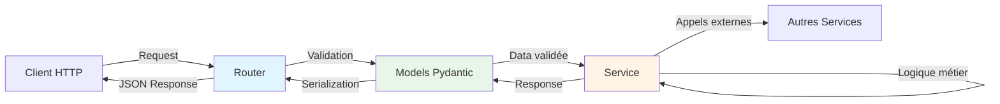
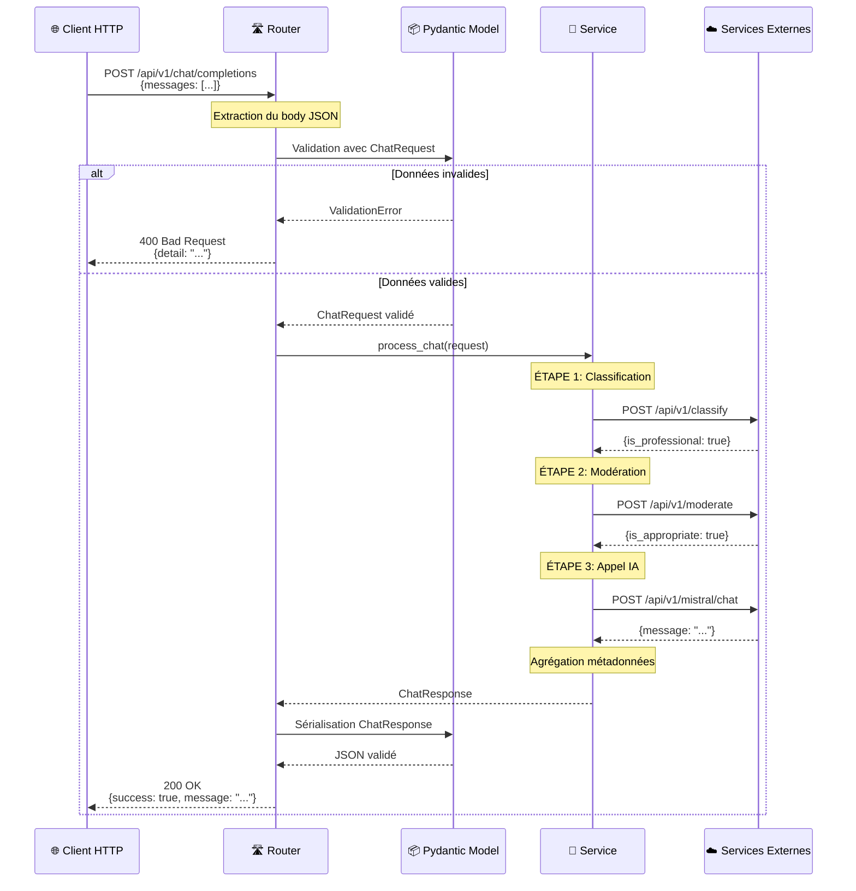
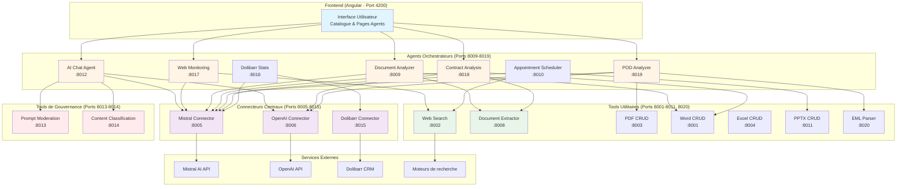
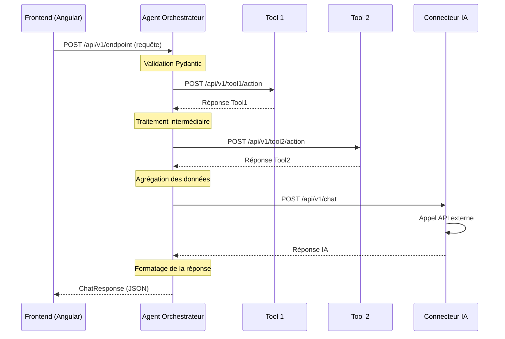
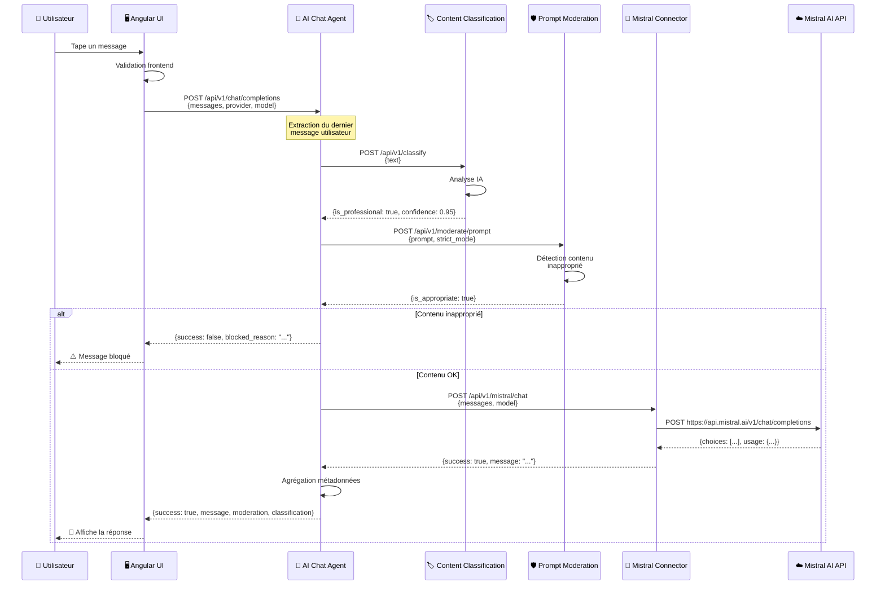
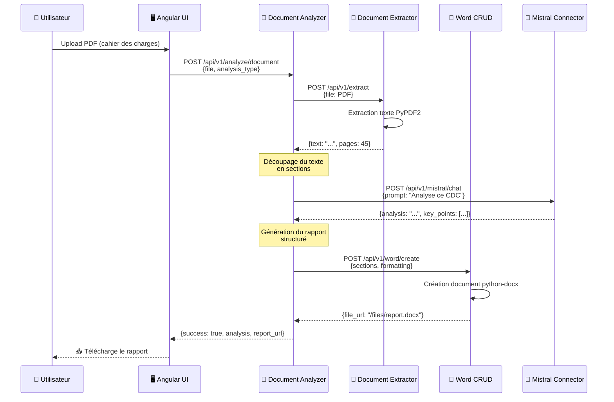
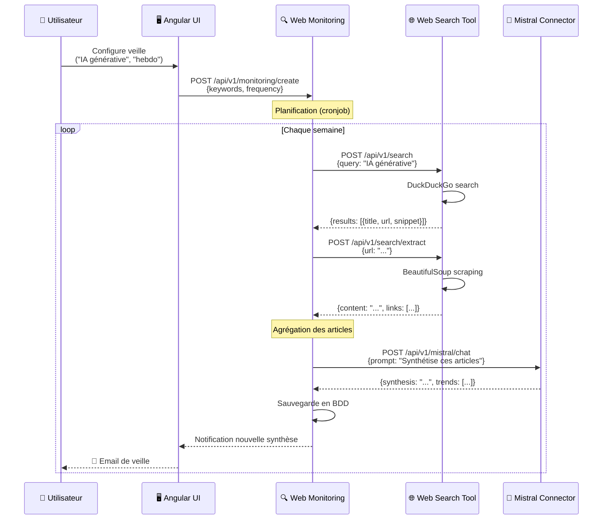

# Architecture des Agents et Outils - Agent-PF

## 📋 Table des Matières

1. [Vue d'Ensemble](#vue-densemble)
2. [Architecture Backend (FastAPI)](#architecture-backend-fastapi)
3. [Architecture Globale](#architecture-globale)
4. [Les Agents Orchestrateurs](#les-agents-orchestrateurs)
5. [Les Tools (Outils)](#les-tools-outils)
6. [Les Connecteurs Centraux](#les-connecteurs-centraux)
7. [Les Briques Graphiques (UI)](#les-briques-graphiques-ui)
8. [Flux de Données Complets](#flux-de-données-complets)
9. [Exemples Pratiques](#exemples-pratiques)
10. [Créer un Nouvel Agent](#créer-un-nouvel-agent)

---

## Vue d'Ensemble

**Agent-PF** est une plateforme d'agents IA orchestrés construite sur une **architecture microservices**. Chaque composant (agent, outil, connecteur) est un service indépendant qui communique via HTTP/REST.

### Principes Architecturaux

- 🎯 **Découplage**: Chaque service est autonome avec sa propre responsabilité
- 🔄 **Réutilisabilité**: Les tools sont partagés entre plusieurs agents
- 🚀 **Scalabilité**: Chaque service peut être scalé indépendamment
- 🛡️ **Résilience**: La défaillance d'un service n'affecte pas les autres
- 🔧 **Maintenabilité**: Code organisé et standardisé (FastAPI + Angular)

### Stack Technique

| Composant | Technologie |
|-----------|-------------|
| **Backend** | FastAPI (Python 3.9+) |
| **Frontend** | Angular 17+ |
| **Orchestration** | Docker Compose |
| **Communication** | HTTP/REST (httpx pour async) |
| **Validation** | Pydantic |
| **IA** | Mistral AI, OpenAI |

---

## Architecture Backend (FastAPI)

Tous les services backend (agents, tools, connecteurs) suivent une **architecture en couches** basée sur FastAPI. Cette architecture sépare les responsabilités en trois couches principales : **Models**, **Services** et **Routers**.

### Vue d'Ensemble des Couches



### Les Trois Couches

#### 1. 📦 Models (Modèles Pydantic)

**Rôle** : Définir les structures de données et la validation

**Responsabilités** :
- ✅ Définir les schémas de **requêtes** (Request Models)
- ✅ Définir les schémas de **réponses** (Response Models)
- ✅ **Validation automatique** des données entrantes
- ✅ **Sérialisation/désérialisation** JSON
- ✅ Documentation auto-générée (OpenAPI)
- ✅ Type hints pour l'IDE et mypy

**Localisation** : `app/models/[nom].py`

**Exemple Concret** :

```python
# agents/ai-chat-agent/app/models/chat.py

from pydantic import BaseModel, Field
from typing import List, Optional, Literal
from enum import Enum

class AIProvider(str, Enum):
    """Providers IA supportés"""
    MISTRAL = "mistral"
    OPENAI = "openai"

class ChatMessage(BaseModel):
    """Modèle d'un message de chat"""
    role: Literal["user", "assistant", "system"]
    content: str = Field(..., min_length=1, description="Contenu du message")

    class Config:
        # Exemple de message pour la doc OpenAPI
        json_schema_extra = {
            "example": {
                "role": "user",
                "content": "Explique-moi les microservices"
            }
        }

class ChatRequest(BaseModel):
    """Requête de chat - validée automatiquement par FastAPI"""
    messages: List[ChatMessage] = Field(..., min_length=1)
    provider: AIProvider = Field(default=AIProvider.MISTRAL)
    model: Optional[str] = Field(default="mistral-large-latest")
    temperature: float = Field(default=0.7, ge=0.0, le=2.0)
    max_tokens: Optional[int] = Field(default=None, ge=1, le=32000)
    strict_mode: bool = Field(default=False, description="Mode strict de modération")

    # Clés API optionnelles
    mistral_api_key: Optional[str] = None
    openai_api_key: Optional[str] = None

    class Config:
        json_schema_extra = {
            "example": {
                "messages": [
                    {"role": "user", "content": "Bonjour"}
                ],
                "provider": "mistral",
                "model": "mistral-large-latest",
                "temperature": 0.7,
                "strict_mode": False
            }
        }

class ChatResponse(BaseModel):
    """Réponse de chat - sérialisée automatiquement par FastAPI"""
    success: bool
    message: Optional[str] = None
    error: Optional[str] = None
    blocked_reason: Optional[str] = None

    # Métadonnées de gouvernance
    moderation_metadata: Optional[dict] = None
    classification_metadata: Optional[dict] = None

    # Métadonnées générales
    metadata: Optional[dict] = None

class ModerationResult(BaseModel):
    """Résultat de modération"""
    is_appropriate: bool
    categories_detected: Optional[List[str]] = []
    severity: Optional[str] = None
    reason: Optional[str] = None
```

**Avantages des Models Pydantic** :
- ✅ Validation automatique (ex: `temperature` doit être entre 0 et 2)
- ✅ Messages d'erreur clairs si données invalides
- ✅ Conversion automatique des types
- ✅ Documentation OpenAPI générée automatiquement
- ✅ Auto-complétion dans l'IDE

---

#### 2. 🧠 Services (Logique Métier)

**Rôle** : Contenir la logique métier et l'orchestration

**Responsabilités** :
- ✅ Implémenter la **logique métier** complexe
- ✅ **Orchestrer** les appels à d'autres services (tools, connecteurs)
- ✅ Gérer les **transformations de données**
- ✅ Gérer les **erreurs** et les **retry**
- ✅ Implémenter les **workflows** multi-étapes
- ❌ **NE PAS** gérer les requêtes HTTP directement (c'est le rôle du router)
- ❌ **NE PAS** stocker d'état (stateless)

**Localisation** : `app/services/[nom]_service.py`

**Pattern** : Classes avec méthodes statiques ou de classe (`@classmethod`)

**Exemple Concret** :

```python
# agents/ai-chat-agent/app/services/chat_service.py

import httpx
from typing import Dict, List
from app.config import settings
from app.models.chat import ChatRequest, ChatResponse, ChatMessage

class ChatService:
    """
    Service d'orchestration du chat IA avec gouvernance

    Responsabilités:
    - Orchestrer le workflow complet (classification -> modération -> IA)
    - Gérer les appels HTTP aux services dépendants
    - Agréger les métadonnées de gouvernance
    """

    # URLs des services dépendants (depuis la config)
    PROMPT_MODERATION_URL = settings.prompt_moderation_url
    CONTENT_CLASSIFICATION_URL = settings.content_classification_url
    MISTRAL_CONNECTOR_URL = settings.mistral_connector_url
    OPENAI_CONNECTOR_URL = settings.openai_connector_url

    @classmethod
    async def process_chat(cls, request: ChatRequest) -> ChatResponse:
        """
        Workflow complet de traitement du chat

        Étapes:
        1. Extraction du dernier message utilisateur
        2. Classification du contenu (professionnel vs non-professionnel)
        3. Modération du prompt (détection contenu inapproprié)
        4. Appel au modèle IA si validation OK
        5. Retour de la réponse enrichie avec métadonnées

        Args:
            request: Requête de chat validée par Pydantic

        Returns:
            Réponse avec message IA et métadonnées de gouvernance
        """

        # Extraction du dernier message utilisateur
        user_messages = [msg for msg in request.messages if msg.role == "user"]
        last_user_prompt = user_messages[-1].content if user_messages else ""

        # 🔍 ÉTAPE 1: Classification du contenu
        classification = await cls._classify_content(last_user_prompt)

        # 🛡️ ÉTAPE 2: Modération du prompt
        moderation = await cls._moderate_prompt(
            last_user_prompt,
            request.strict_mode
        )

        # ❌ Blocage si contenu inapproprié détecté
        if not moderation.get("is_appropriate", True):
            return ChatResponse(
                success=False,
                error="Contenu inapproprié détecté",
                blocked_reason=moderation.get("reason", "Contenu non conforme détecté"),
                moderation_metadata=moderation,
                classification_metadata=classification,
                metadata={
                    "blocked_at_stage": "moderation",
                    "processing_time_seconds": 0
                }
            )

        # 🤖 ÉTAPE 3: Appel au modèle IA
        try:
            ai_response = await cls._call_ai_provider(request)

            # ✅ Retour de la réponse enrichie
            return ChatResponse(
                success=True,
                message=ai_response.get("message"),
                moderation_metadata=moderation,
                classification_metadata=classification,
                metadata={
                    "provider": request.provider,
                    "model": request.model,
                    "processing_time_seconds": ai_response.get("processing_time", 0)
                }
            )

        except Exception as e:
            return ChatResponse(
                success=False,
                error=f"Erreur lors de l'appel IA: {str(e)}",
                moderation_metadata=moderation,
                classification_metadata=classification
            )

    @classmethod
    async def _classify_content(cls, text: str) -> Dict:
        """Appelle le service de classification de contenu"""
        async with httpx.AsyncClient(timeout=30.0) as client:
            try:
                response = await client.post(
                    f"{cls.CONTENT_CLASSIFICATION_URL}/api/v1/classify",
                    json={"text": text}
                )

                if response.status_code == 200:
                    return response.json()
                else:
                    # Fallback en cas d'erreur
                    return {"is_professional": True, "confidence": 0.0}

            except Exception as e:
                print(f"❌ Erreur classification: {e}")
                return {"is_professional": True, "confidence": 0.0}

    @classmethod
    async def _moderate_prompt(cls, prompt: str, strict_mode: bool) -> Dict:
        """Appelle le service de modération de prompts"""
        async with httpx.AsyncClient(timeout=30.0) as client:
            try:
                response = await client.post(
                    f"{cls.PROMPT_MODERATION_URL}/api/v1/moderate/prompt",
                    json={
                        "prompt": prompt,
                        "strict_mode": strict_mode
                    }
                )

                if response.status_code == 200:
                    return response.json()
                else:
                    # Fallback: autoriser par défaut si le service est down
                    return {"is_appropriate": True}

            except Exception as e:
                print(f"❌ Erreur modération: {e}")
                return {"is_appropriate": True}

    @classmethod
    async def _call_ai_provider(cls, request: ChatRequest) -> Dict:
        """Appelle le connecteur IA (Mistral ou OpenAI)"""

        # Sélection du connecteur selon le provider
        if request.provider == "mistral":
            url = f"{cls.MISTRAL_CONNECTOR_URL}/api/v1/mistral/chat"
        elif request.provider == "openai":
            url = f"{cls.OPENAI_CONNECTOR_URL}/api/v1/openai/chat"
        else:
            raise ValueError(f"Provider inconnu: {request.provider}")

        # Préparation de la requête
        payload = {
            "messages": [msg.dict() for msg in request.messages],
            "model": request.model,
            "temperature": request.temperature,
            "max_tokens": request.max_tokens
        }

        # Ajout de la clé API si fournie
        if request.mistral_api_key:
            payload["api_key"] = request.mistral_api_key
        if request.openai_api_key:
            payload["api_key"] = request.openai_api_key

        # Appel au connecteur
        async with httpx.AsyncClient(timeout=120.0) as client:
            response = await client.post(url, json=payload)
            response.raise_for_status()
            return response.json()
```

**Bonnes Pratiques pour les Services** :
- ✅ Méthodes **publiques** pour les fonctions principales (`process_chat`)
- ✅ Méthodes **privées** (préfixe `_`) pour les sous-tâches (`_classify_content`)
- ✅ **Asynchrone** (`async`/`await`) pour les appels I/O
- ✅ Gestion des **erreurs** avec try/except
- ✅ **Fallbacks** en cas d'erreur (ex: classification par défaut)
- ✅ **Logging** pour le debugging
- ❌ **NE PAS** accéder directement à `request.headers` (c'est le rôle du router)

---

#### 3. 🛣️ Routers (Points d'Entrée API)

**Rôle** : Exposer les endpoints HTTP et orchestrer la requête/réponse

**Responsabilités** :
- ✅ Définir les **routes** (endpoints) de l'API
- ✅ Déclarer les **méthodes HTTP** (GET, POST, PUT, DELETE)
- ✅ Gérer l'**authentification/autorisation** (si nécessaire)
- ✅ Extraire les paramètres (query, path, body, headers)
- ✅ Appeler les **services** pour la logique métier
- ✅ Gérer les **codes HTTP** de réponse (200, 400, 500, etc.)
- ❌ **NE PAS** contenir de logique métier complexe

**Localisation** : `app/routers/[nom].py`

**Pattern** : APIRouter de FastAPI

**Exemple Concret** :

```python
# agents/ai-chat-agent/app/routers/chat.py

from fastapi import APIRouter, HTTPException, Header, Depends
from typing import Optional
from app.models.chat import ChatRequest, ChatResponse
from app.services.chat_service import ChatService

# Création du router
router = APIRouter(
    prefix="/api/v1/chat",
    tags=["Chat"]  # Pour la doc OpenAPI
)

@router.post("/completions", response_model=ChatResponse)
async def chat_completions(
    request: ChatRequest,
    x_api_key: Optional[str] = Header(None)
) -> ChatResponse:
    """
    Endpoint principal de chat avec gouvernance

    Fonctionnalités:
    - Classification automatique du contenu
    - Modération du prompt
    - Appel au modèle IA (Mistral ou OpenAI)
    - Retour des métadonnées de gouvernance

    Args:
        request: Requête de chat (validée par Pydantic)
        x_api_key: Clé API optionnelle (header HTTP)

    Returns:
        Réponse avec message IA et métadonnées

    Raises:
        HTTPException: Si erreur serveur (500)
    """

    try:
        # Appel au service (toute la logique est là-bas)
        response = await ChatService.process_chat(request)
        return response

    except ValueError as e:
        # Erreur de validation (ex: provider inconnu)
        raise HTTPException(
            status_code=400,
            detail=f"Requête invalide: {str(e)}"
        )

    except Exception as e:
        # Erreur serveur
        raise HTTPException(
            status_code=500,
            detail=f"Erreur lors du traitement: {str(e)}"
        )

@router.get("/providers")
async def list_providers():
    """
    Liste des providers IA disponibles

    Returns:
        Liste des providers avec leurs modèles
    """
    return {
        "providers": [
            {
                "id": "mistral",
                "name": "Mistral AI",
                "models": [
                    "mistral-large-latest",
                    "mistral-small-latest",
                    "mistral-medium-latest"
                ]
            },
            {
                "id": "openai",
                "name": "OpenAI",
                "models": [
                    "gpt-4",
                    "gpt-4-turbo",
                    "gpt-3.5-turbo"
                ]
            }
        ]
    }

@router.get("/models/{provider}")
async def list_models_for_provider(provider: str):
    """
    Liste les modèles disponibles pour un provider

    Args:
        provider: ID du provider (mistral, openai)

    Returns:
        Liste des modèles

    Raises:
        HTTPException: Si provider inconnu (404)
    """

    models_map = {
        "mistral": [
            "mistral-large-latest",
            "mistral-small-latest"
        ],
        "openai": [
            "gpt-4",
            "gpt-3.5-turbo"
        ]
    }

    if provider not in models_map:
        raise HTTPException(
            status_code=404,
            detail=f"Provider '{provider}' non trouvé"
        )

    return {
        "provider": provider,
        "models": models_map[provider]
    }

@router.delete("/history/{session_id}")
async def clear_chat_history(
    session_id: str,
    x_api_key: str = Header(...)
):
    """
    Supprime l'historique d'une session

    Args:
        session_id: ID de la session
        x_api_key: Clé API (obligatoire via header)

    Returns:
        Confirmation de suppression
    """

    # Note: En production, vérifier x_api_key avant de continuer

    # Appel à un service de gestion de sessions (non implémenté ici)
    # await SessionService.clear_history(session_id)

    return {
        "success": True,
        "message": f"Historique de la session {session_id} supprimé"
    }
```

**Bonnes Pratiques pour les Routers** :
- ✅ Utiliser les **type hints** pour auto-génération de la doc
- ✅ Déclarer `response_model` pour validation de sortie
- ✅ Gérer les **codes HTTP** appropriés (200, 400, 404, 500)
- ✅ Utiliser `HTTPException` pour les erreurs
- ✅ Documenter avec **docstrings** (apparaît dans OpenAPI)
- ✅ Grouper par **tags** pour la doc
- ❌ **NE PAS** mettre de logique métier (ça va dans le service)

---

### Flux de Requête Complet

Voici le chemin d'une requête HTTP à travers les trois couches :



---

### Tableau Récapitulatif

| Couche | Localisation | Responsabilité Principale | Dépendances |
|--------|-------------|---------------------------|-------------|
| **Models** | `app/models/` | Définir structures de données et validation | Pydantic |
| **Services** | `app/services/` | Logique métier et orchestration | httpx, Models, Config |
| **Routers** | `app/routers/` | Endpoints HTTP et gestion requêtes/réponses | FastAPI, Models, Services |

---

### Exemple de Dossier Complet

```
agents/ai-chat-agent/
├── app/
│   ├── models/
│   │   ├── __init__.py
│   │   └── chat.py              # ✅ ChatRequest, ChatResponse, ChatMessage
│   ├── services/
│   │   ├── __init__.py
│   │   └── chat_service.py      # ✅ ChatService.process_chat()
│   ├── routers/
│   │   ├── __init__.py
│   │   └── chat.py              # ✅ @router.post("/completions")
│   ├── config.py                # ⚙️ Settings et URLs
│   └── main.py                  # 🚀 FastAPI app + include_router()
```

---

### Avantages de cette Architecture

✅ **Séparation des responsabilités** : Chaque couche a un rôle clair

✅ **Testabilité** : Services et Models peuvent être testés indépendamment

✅ **Maintenabilité** : Facile de modifier la logique métier sans toucher aux routes

✅ **Réutilisabilité** : Les services peuvent être appelés depuis plusieurs routers

✅ **Documentation auto-générée** : OpenAPI/Swagger créé automatiquement

✅ **Validation automatique** : Pydantic valide les données à l'entrée/sortie

✅ **Type safety** : Détection d'erreurs avec mypy et auto-complétion IDE

---

## Architecture Globale



### Légende des Couleurs

- 🔵 **Bleu**: Interface utilisateur (Angular)
- 🟠 **Orange**: Agents orchestrateurs (logique métier)
- 🟣 **Violet**: Connecteurs centraux (accès APIs externes)
- 🟢 **Vert**: Tools utilitaires (fonctions spécialisées)
- 🔴 **Rouge**: Tools de gouvernance (sécurité/modération)

---

## Les Agents Orchestrateurs

### Définition

Un **agent** est un microservice qui:
- ✅ Coordonne plusieurs outils et connecteurs
- ✅ Implémente une logique métier complexe
- ✅ Expose une API REST publique utilisée par le frontend
- ✅ Gère les workflows multi-étapes
- ✅ Ne fait pas de calcul direct, délègue aux tools

### Liste des Agents

| Agent | Port | Description | Outils Utilisés |
|-------|------|-------------|-----------------|
| **AI Chat Agent** | 8012 | Chat IA avec gouvernance | Prompt Moderation, Content Classification, Mistral/OpenAI |
| **Web Monitoring Agent** | 8017 | Veille technologique automatisée | Web Search, Mistral/OpenAI |
| **Document Analyzer** | 8009 | Analyse de documents (appels d'offre) | Document Extractor, Word CRUD, Mistral |
| **Appointment Scheduler** | 8010 | Préparation rendez-vous commerciaux | Web Search, PPTX CRUD, Mistral |
| **Contract Analysis Agent** | 8018 | Analyse juridique de contrats | Document Extractor, Word CRUD, Mistral/OpenAI |
| **Dolibarr Stats Agent** | 8016 | Analyse CRM avec recommandations | Dolibarr Connector, Mistral |
| **Email POD Analyzer** | 8019 | Corrélation POD/BDC dans emails | EML Parser, PDF CRUD, Mistral/OpenAI |

### Structure d'un Agent

```
agents/[agent-name]/
├── app/
│   ├── main.py                    # 🚀 Point d'entrée FastAPI
│   ├── config.py                  # ⚙️ Configuration (URLs des dépendances)
│   ├── routers/                   # 🛣️ Endpoints API
│   │   ├── __init__.py
│   │   └── [endpoint].py          # Ex: chat.py, analyze.py
│   ├── services/                  # 🧠 Logique d'orchestration
│   │   ├── __init__.py
│   │   └── [service].py           # Ex: chat_service.py
│   ├── models/                    # 📦 Modèles Pydantic
│   │   ├── __init__.py
│   │   └── [models].py            # Schemas request/response
│   └── middleware/                # 🔒 Middleware (auth, etc.)
│       └── auth.py
├── requirements.txt               # 📋 Dépendances Python
├── Dockerfile                     # 🐳 Image Docker
└── README.md                      # 📖 Documentation
```

### Exemple de Configuration

**Fichier**: `agents/ai-chat-agent/app/config.py`

```python
import os
from pydantic_settings import BaseSettings

class Settings(BaseSettings):
    # Informations de base
    app_name: str = "AI Chat Agent"
    version: str = "1.0.0"

    # URLs des services dépendants
    prompt_moderation_url: str = os.getenv(
        "PROMPT_MODERATION_URL",
        "http://prompt-moderation-tool:8000"
    )
    content_classification_url: str = os.getenv(
        "CONTENT_CLASSIFICATION_URL",
        "http://content-classification-tool:8000"
    )
    mistral_connector_url: str = os.getenv(
        "MISTRAL_CONNECTOR_URL",
        "http://mistral-connector:8000"
    )
    openai_connector_url: str = os.getenv(
        "OPENAI_CONNECTOR_URL",
        "http://openai-connector:8000"
    )

    class Config:
        env_file = ".env"

settings = Settings()
```

### Exemple de Point d'Entrée

**Fichier**: `agents/ai-chat-agent/app/main.py`

```python
from fastapi import FastAPI
from fastapi.middleware.cors import CORSMiddleware
from app.config import settings
from app.routers import chat

# Initialisation de l'application FastAPI
app = FastAPI(
    title=settings.app_name,
    version=settings.version,
    description="Agent de chat IA avec gouvernance"
)

# Configuration CORS
app.add_middleware(
    CORSMiddleware,
    allow_origins=["*"],  # En production: spécifier les domaines
    allow_credentials=True,
    allow_methods=["*"],
    allow_headers=["*"],
)

# Inclusion des routers
app.include_router(chat.router, tags=["Chat"])

# Health check (utilisé par Docker)
@app.get("/health")
async def health():
    return {
        "status": "healthy",
        "service": settings.app_name,
        "version": settings.version
    }

# Informations sur le service
@app.get("/")
async def root():
    return {
        "service": settings.app_name,
        "version": settings.version,
        "endpoints": [
            "/api/v1/chat/completions",
            "/api/v1/chat/providers",
            "/health"
        ]
    }
```

### Exemple de Service d'Orchestration

**Fichier**: `agents/ai-chat-agent/app/services/chat_service.py`

```python
import httpx
from typing import List, Dict
from app.config import settings
from app.models.chat import ChatRequest, ChatResponse, ChatMessage

class ChatService:
    """Service d'orchestration pour le chat IA avec gouvernance"""

    PROMPT_MODERATION_URL = settings.prompt_moderation_url
    CONTENT_CLASSIFICATION_URL = settings.content_classification_url
    MISTRAL_CONNECTOR_URL = settings.mistral_connector_url
    OPENAI_CONNECTOR_URL = settings.openai_connector_url

    @classmethod
    async def process_chat(cls, request: ChatRequest) -> ChatResponse:
        """
        Workflow complet de traitement du chat:
        1. Classification du contenu
        2. Modération du prompt
        3. Appel au modèle IA
        """

        # Extraction du dernier message utilisateur
        user_messages = [msg for msg in request.messages if msg.role == "user"]
        last_user_prompt = user_messages[-1].content if user_messages else ""

        # 🔍 ÉTAPE 1: Classification du contenu
        classification = await cls._classify_content(last_user_prompt)

        # 🛡️ ÉTAPE 2: Modération du prompt
        moderation = await cls._moderate_prompt(
            last_user_prompt,
            request.strict_mode
        )

        # ❌ Blocage si contenu inapproprié détecté
        if not moderation.get("is_appropriate", True):
            return ChatResponse(
                success=False,
                error="Contenu inapproprié détecté",
                blocked_reason=moderation.get("reason", ""),
                moderation_metadata=moderation,
                classification_metadata=classification,
                metadata={
                    "blocked_at_stage": "moderation",
                    "processing_time_seconds": 0
                }
            )

        # 🤖 ÉTAPE 3: Appel au modèle IA
        ai_response = await cls._call_ai_provider(request)

        # ✅ Retour de la réponse enrichie
        return ChatResponse(
            success=True,
            message=ai_response.get("message"),
            moderation_metadata=moderation,
            classification_metadata=classification,
            metadata={
                "provider": request.provider,
                "model": request.model,
                "processing_time_seconds": ai_response.get("processing_time", 0)
            }
        )

    @classmethod
    async def _classify_content(cls, text: str) -> Dict:
        """Appelle le service de classification de contenu"""
        async with httpx.AsyncClient(timeout=30.0) as client:
            try:
                response = await client.post(
                    f"{cls.CONTENT_CLASSIFICATION_URL}/api/v1/classify",
                    json={"text": text}
                )

                if response.status_code == 200:
                    return response.json()
                else:
                    return {"is_professional": True, "confidence": 0.0}

            except Exception as e:
                print(f"❌ Erreur classification: {e}")
                return {"is_professional": True, "confidence": 0.0}

    @classmethod
    async def _moderate_prompt(cls, prompt: str, strict_mode: bool) -> Dict:
        """Appelle le service de modération de prompts"""
        async with httpx.AsyncClient(timeout=30.0) as client:
            try:
                response = await client.post(
                    f"{cls.PROMPT_MODERATION_URL}/api/v1/moderate/prompt",
                    json={
                        "prompt": prompt,
                        "strict_mode": strict_mode
                    }
                )

                if response.status_code == 200:
                    return response.json()
                else:
                    return {"is_appropriate": True}

            except Exception as e:
                print(f"❌ Erreur modération: {e}")
                return {"is_appropriate": True}

    @classmethod
    async def _call_ai_provider(cls, request: ChatRequest) -> Dict:
        """Appelle le connecteur IA (Mistral ou OpenAI)"""

        # Sélection du connecteur selon le provider
        if request.provider == "mistral":
            url = f"{cls.MISTRAL_CONNECTOR_URL}/api/v1/mistral/chat"
        elif request.provider == "openai":
            url = f"{cls.OPENAI_CONNECTOR_URL}/api/v1/openai/chat"
        else:
            raise ValueError(f"Provider inconnu: {request.provider}")

        # Préparation de la requête
        payload = {
            "messages": [msg.dict() for msg in request.messages],
            "model": request.model,
            "temperature": request.temperature,
            "max_tokens": request.max_tokens
        }

        # Ajout de la clé API si fournie
        if request.mistral_api_key:
            payload["api_key"] = request.mistral_api_key
        if request.openai_api_key:
            payload["api_key"] = request.openai_api_key

        # Appel au connecteur
        async with httpx.AsyncClient(timeout=120.0) as client:
            response = await client.post(url, json=payload)
            response.raise_for_status()
            return response.json()
```

### Exemple de Router

**Fichier**: `agents/ai-chat-agent/app/routers/chat.py`

```python
from fastapi import APIRouter, HTTPException
from app.models.chat import ChatRequest, ChatResponse
from app.services.chat_service import ChatService

router = APIRouter(prefix="/api/v1/chat")

@router.post("/completions", response_model=ChatResponse)
async def chat_completions(request: ChatRequest) -> ChatResponse:
    """
    Endpoint principal de chat avec gouvernance

    - Classification automatique du contenu
    - Modération du prompt
    - Appel au modèle IA
    """
    try:
        response = await ChatService.process_chat(request)
        return response

    except Exception as e:
        raise HTTPException(
            status_code=500,
            detail=f"Erreur lors du traitement: {str(e)}"
        )

@router.get("/providers")
async def list_providers():
    """Liste des providers IA disponibles"""
    return {
        "providers": [
            {
                "id": "mistral",
                "name": "Mistral AI",
                "models": ["mistral-large-latest", "mistral-small-latest"]
            },
            {
                "id": "openai",
                "name": "OpenAI",
                "models": ["gpt-4", "gpt-3.5-turbo"]
            }
        ]
    }
```

### Workflow d'un Agent



---

## Les Tools (Outils)

### Définition

Un **tool** est un microservice spécialisé qui:
- ✅ Fournit **une seule fonctionnalité** bien définie
- ✅ Peut être utilisé par **plusieurs agents**
- ✅ N'appelle pas d'autres tools (sauf exceptions)
- ✅ Est **stateless** (sans état partagé)
- ✅ Expose une API REST simple

### Catégories de Tools

#### 1. Tools Utilitaires (Fonctions Techniques)

| Tool | Port | Fonction | Technologie |
|------|------|----------|-------------|
| **Web Search** | 8002 | Recherche web multi-moteurs | DuckDuckGo, BeautifulSoup |
| **Document Extractor** | 8008 | Extraction texte de documents | PyPDF2, python-docx, openpyxl |
| **PDF CRUD** | 8003 | Manipulation de fichiers PDF | ReportLab, PyPDF2 |
| **Word CRUD** | 8001 | Manipulation de fichiers Word | python-docx |
| **Excel CRUD** | 8004 | Manipulation de fichiers Excel | openpyxl |
| **PPTX CRUD** | 8011 | Manipulation de fichiers PowerPoint | python-pptx |
| **File Upload** | 8007 | Gestion d'upload de fichiers | FastAPI UploadFile |
| **EML Parser** | 8020 | Parsing d'emails (.eml) | email (stdlib) |

#### 2. Tools de Gouvernance (Sécurité & Conformité)

| Tool | Port | Fonction | Technologie |
|------|------|----------|-------------|
| **Prompt Moderation** | 8013 | Détection contenu inapproprié | Mistral Moderation API |
| **Content Classification** | 8014 | Classification professionnel/non-professionnel | Mistral AI |

### Structure d'un Tool

```
tools/[tool-name]/
├── app/
│   ├── main.py                    # 🚀 Point d'entrée FastAPI
│   ├── config.py                  # ⚙️ Configuration minimale
│   ├── routers/                   # 🛣️ Endpoints API
│   │   └── [operation].py         # Ex: search.py, extract.py
│   ├── services/                  # 🧠 Logique métier
│   │   └── [service].py           # Ex: search_service.py
│   └── models/                    # 📦 Modèles Pydantic
│       └── [models].py
├── requirements.txt
├── Dockerfile
└── README.md
```

### Exemple de Tool: Web Search

#### Configuration

**Fichier**: `tools/web-search-tool/app/config.py`

```python
from pydantic_settings import BaseSettings

class Settings(BaseSettings):
    app_name: str = "Web Search Tool"
    version: str = "1.0.0"

    # Pas de dépendances externes (tool autonome)
    default_search_engine: str = "duckduckgo"
    max_results: int = 10
    timeout_seconds: int = 30

settings = Settings()
```

#### Service

**Fichier**: `tools/web-search-tool/app/services/search_service.py`

```python
import httpx
from bs4 import BeautifulSoup
from typing import List, Dict
from app.models.search import SearchRequest, SearchResult

class SearchService:
    """Service de recherche web multi-moteurs"""

    @staticmethod
    async def search(request: SearchRequest) -> List[SearchResult]:
        """
        Effectue une recherche web

        Supporte: DuckDuckGo, Google, Bing
        """

        if request.engine == "duckduckgo":
            return await SearchService._search_duckduckgo(
                request.query,
                request.max_results
            )

        elif request.engine == "google":
            return await SearchService._search_google(
                request.query,
                request.max_results
            )

        elif request.engine == "bing":
            return await SearchService._search_bing(
                request.query,
                request.max_results
            )

        else:
            raise ValueError(f"Moteur inconnu: {request.engine}")

    @staticmethod
    async def _search_duckduckgo(query: str, max_results: int) -> List[SearchResult]:
        """Recherche sur DuckDuckGo"""

        url = "https://html.duckduckgo.com/html/"
        params = {"q": query}

        async with httpx.AsyncClient(timeout=30.0) as client:
            response = await client.post(url, data=params)
            response.raise_for_status()

            soup = BeautifulSoup(response.text, "html.parser")
            results = []

            for result in soup.find_all("div", class_="result")[:max_results]:
                title_elem = result.find("a", class_="result__a")
                snippet_elem = result.find("a", class_="result__snippet")

                if title_elem:
                    results.append(SearchResult(
                        title=title_elem.get_text(strip=True),
                        url=title_elem.get("href", ""),
                        snippet=snippet_elem.get_text(strip=True) if snippet_elem else ""
                    ))

            return results

    @staticmethod
    async def extract_page_content(url: str) -> Dict:
        """Extrait le contenu d'une page web"""

        async with httpx.AsyncClient(timeout=30.0) as client:
            response = await client.get(url)
            response.raise_for_status()

            soup = BeautifulSoup(response.text, "html.parser")

            # Suppression des scripts et styles
            for tag in soup(["script", "style"]):
                tag.decompose()

            # Extraction du texte
            text = soup.get_text(separator="\n", strip=True)

            return {
                "url": url,
                "title": soup.title.string if soup.title else "",
                "content": text,
                "links": [a.get("href") for a in soup.find_all("a", href=True)]
            }
```

#### Router

**Fichier**: `tools/web-search-tool/app/routers/search.py`

```python
from fastapi import APIRouter, HTTPException
from app.models.search import SearchRequest, SearchResponse, PageContentRequest
from app.services.search_service import SearchService

router = APIRouter(prefix="/api/v1/search")

@router.post("/", response_model=SearchResponse)
async def search_web(request: SearchRequest) -> SearchResponse:
    """Effectue une recherche web"""
    try:
        results = await SearchService.search(request)

        return SearchResponse(
            success=True,
            query=request.query,
            engine=request.engine,
            results=results,
            count=len(results)
        )

    except Exception as e:
        raise HTTPException(
            status_code=500,
            detail=f"Erreur de recherche: {str(e)}"
        )

@router.post("/extract")
async def extract_content(request: PageContentRequest):
    """Extrait le contenu d'une page web"""
    try:
        content = await SearchService.extract_page_content(request.url)
        return content

    except Exception as e:
        raise HTTPException(
            status_code=500,
            detail=f"Erreur d'extraction: {str(e)}"
        )
```

#### Modèles

**Fichier**: `tools/web-search-tool/app/models/search.py`

```python
from pydantic import BaseModel, Field, HttpUrl
from typing import List, Optional
from enum import Enum

class SearchEngine(str, Enum):
    """Moteurs de recherche supportés"""
    DUCKDUCKGO = "duckduckgo"
    GOOGLE = "google"
    BING = "bing"

class SearchRequest(BaseModel):
    """Requête de recherche"""
    query: str = Field(..., min_length=1, description="Requête de recherche")
    engine: SearchEngine = Field(default=SearchEngine.DUCKDUCKGO)
    max_results: int = Field(default=10, ge=1, le=50)

class SearchResult(BaseModel):
    """Résultat de recherche"""
    title: str
    url: str
    snippet: Optional[str] = None

class SearchResponse(BaseModel):
    """Réponse de recherche"""
    success: bool
    query: str
    engine: str
    results: List[SearchResult]
    count: int

class PageContentRequest(BaseModel):
    """Requête d'extraction de contenu"""
    url: HttpUrl
```

---

## Les Connecteurs Centraux

### Définition

Un **connecteur** est un service qui:
- ✅ Encapsule l'accès à une **API externe**
- ✅ Gère les **clés API** et l'**authentification**
- ✅ Fournit une **interface unifiée** pour tous les agents
- ✅ Gère les **erreurs** et les **retry**

### Liste des Connecteurs

| Connecteur | Port | API Externe | Fonctionnalités |
|-----------|------|-------------|-----------------|
| **Mistral Connector** | 8005 | Mistral AI | Chat, Embeddings, Modération |
| **OpenAI Connector** | 8006 | OpenAI | Chat, Embeddings, Modèles |
| **Dolibarr Connector** | 8015 | Dolibarr CRM | Stats, Clients, Projets |

### Exemple: Mistral Connector

**Fichier**: `core/mistral-connector/app/routers/chat.py`

```python
from fastapi import APIRouter, HTTPException
import httpx
from app.config import settings
from app.models.chat import MistralChatRequest, MistralChatResponse

router = APIRouter(prefix="/api/v1/mistral")

@router.post("/chat", response_model=MistralChatResponse)
async def chat_completion(request: MistralChatRequest):
    """
    Appel à l'API Mistral Chat

    Encapsule l'authentification et la gestion d'erreurs
    """

    # Utilisation de la clé API fournie ou celle par défaut
    api_key = request.api_key or settings.mistral_api_key

    if not api_key:
        raise HTTPException(
            status_code=401,
            detail="Clé API Mistral manquante"
        )

    # Préparation de la requête
    payload = {
        "model": request.model,
        "messages": [msg.dict() for msg in request.messages],
        "temperature": request.temperature,
        "max_tokens": request.max_tokens
    }

    headers = {
        "Authorization": f"Bearer {api_key}",
        "Content-Type": "application/json"
    }

    # Appel à l'API Mistral
    async with httpx.AsyncClient(timeout=120.0) as client:
        try:
            response = await client.post(
                "https://api.mistral.ai/v1/chat/completions",
                json=payload,
                headers=headers
            )
            response.raise_for_status()

            data = response.json()

            return MistralChatResponse(
                success=True,
                message=data["choices"][0]["message"]["content"],
                model=data["model"],
                usage=data.get("usage", {}),
                metadata={
                    "finish_reason": data["choices"][0]["finish_reason"]
                }
            )

        except httpx.HTTPStatusError as e:
            raise HTTPException(
                status_code=e.response.status_code,
                detail=f"Erreur API Mistral: {e.response.text}"
            )

        except Exception as e:
            raise HTTPException(
                status_code=500,
                detail=f"Erreur interne: {str(e)}"
            )

@router.get("/models")
async def list_models():
    """Liste les modèles Mistral disponibles"""

    api_key = settings.mistral_api_key

    if not api_key:
        raise HTTPException(
            status_code=401,
            detail="Clé API Mistral manquante"
        )

    async with httpx.AsyncClient(timeout=30.0) as client:
        response = await client.get(
            "https://api.mistral.ai/v1/models",
            headers={"Authorization": f"Bearer {api_key}"}
        )
        response.raise_for_status()
        return response.json()
```

---

## Les Briques Graphiques (UI)

### Architecture Frontend

```
ui/frontend/src/app/
├── pages/                          # Pages des agents
│   ├── agents-catalog/             # 🏠 Catalogue central
│   │   ├── agents-catalog.component.ts
│   │   └── agents-catalog.component.html
│   ├── ai-chat/                    # 💬 Page AI Chat
│   │   ├── ai-chat.component.ts
│   │   ├── ai-chat.component.html
│   │   └── chat-config-dialog/     # Configuration
│   ├── web-monitoring-agent/       # 🔍 Veille web
│   ├── document-analyzer/          # 📄 Analyse documents
│   ├── contract-analysis/          # ⚖️ Analyse contrats
│   └── pod-analyzer/               # 📧 Analyse POD
├── services/                       # Services Angular
│   └── api.service.ts
├── models/                         # Modèles TypeScript
│   └── agent.model.ts
└── shared/                         # Composants partagés
    ├── header/
    └── loader/
```

### Configuration des Endpoints

**Fichier**: `ui/frontend/src/environments/environment.ts`

```typescript
export const environment = {
  production: false,

  api: {
    // Tools
    wordCrud: 'http://localhost:8001',
    webSearch: 'http://localhost:8002',
    pdfCrud: 'http://localhost:8003',
    excelCrud: 'http://localhost:8004',
    documentExtractor: 'http://localhost:8008',
    pptxCrud: 'http://localhost:8011',

    // Connecteurs
    mistralConnector: 'http://localhost:8005',
    openaiConnector: 'http://localhost:8006',
    dolibarrConnector: 'http://localhost:8015',

    // Agents
    aiChat: 'http://localhost:8012',
    promptModeration: 'http://localhost:8013',
    contentClassification: 'http://localhost:8014',
    webMonitoring: 'http://localhost:8017',
    contractAnalysis: 'http://localhost:8018',
    podAnalyzer: 'http://localhost:8019',
    documentAnalyzer: 'http://localhost:8009',
    appointmentScheduler: 'http://localhost:8010',
    dolibarrStats: 'http://localhost:8016'
  }
};
```

### Catalogue des Agents

**Fichier**: `ui/frontend/src/app/pages/agents-catalog/agents-catalog.component.ts`

```typescript
import { Component, OnInit } from '@angular/core';
import { Router } from '@angular/router';

export interface Agent {
  id: string;
  name: string;
  description: string;
  icon: string;
  route: string;
  hasConfig: boolean;
  status: 'active' | 'beta' | 'coming-soon';
}

@Component({
  selector: 'app-agents-catalog',
  templateUrl: './agents-catalog.component.html',
  styleUrls: ['./agents-catalog.component.scss']
})
export class AgentsCatalogComponent implements OnInit {

  agents: Agent[] = [
    {
      id: 'ai-chat',
      name: 'Assistant IA Professionnel',
      description: 'Chat IA avec gouvernance et modération de contenu',
      icon: 'chat',
      route: '/ai-chat',
      hasConfig: true,
      status: 'active'
    },
    {
      id: 'web-monitoring',
      name: 'Veille Technologique',
      description: 'Surveillance et synthèse d\'actualités web',
      icon: 'search',
      route: '/web-monitoring',
      hasConfig: true,
      status: 'active'
    },
    {
      id: 'document-analyzer',
      name: 'Analyse de Documents',
      description: 'Analyse d\'appels d\'offre et cahiers des charges',
      icon: 'description',
      route: '/document-analyzer',
      hasConfig: false,
      status: 'active'
    },
    {
      id: 'contract-analysis',
      name: 'Analyse de Contrats',
      description: 'Analyse juridique de contrats avec extraction de clauses',
      icon: 'gavel',
      route: '/contract-analysis',
      hasConfig: false,
      status: 'active'
    },
    {
      id: 'pod-analyzer',
      name: 'Analyseur POD/BDC',
      description: 'Corrélation automatique entre POD et bons de commande',
      icon: 'email',
      route: '/pod-analyzer',
      hasConfig: true,
      status: 'active'
    },
    {
      id: 'appointment-scheduler',
      name: 'Préparateur de Rendez-vous',
      description: 'Préparation de rendez-vous commerciaux avec recherche',
      icon: 'calendar_today',
      route: '/appointment-scheduler',
      hasConfig: false,
      status: 'beta'
    },
    {
      id: 'dolibarr-stats',
      name: 'Analyse CRM Dolibarr',
      description: 'Statistiques et recommandations depuis Dolibarr',
      icon: 'analytics',
      route: '/dolibarr-stats',
      hasConfig: false,
      status: 'active'
    }
  ];

  constructor(private router: Router) {}

  ngOnInit(): void {
    // Initialisation
  }

  navigateToAgent(agent: Agent): void {
    this.router.navigate([agent.route]);
  }

  openConfig(agent: Agent, event: Event): void {
    event.stopPropagation();
    this.router.navigate([agent.route], { queryParams: { config: true } });
  }
}
```

### Exemple de Composant Agent: AI Chat

**Fichier**: `ui/frontend/src/app/pages/ai-chat/ai-chat.component.ts`

```typescript
import { Component, OnInit } from '@angular/core';
import { HttpClient } from '@angular/common/http';
import { firstValueFrom, timeout } from 'rxjs';
import { environment } from '../../../environments/environment';

export interface ChatMessage {
  role: 'user' | 'assistant' | 'system';
  content: string;
  timestamp?: Date;
}

export interface ChatRequest {
  messages: ChatMessage[];
  provider: 'mistral' | 'openai';
  model?: string;
  temperature?: number;
  max_tokens?: number;
  strict_mode?: boolean;
  mistral_api_key?: string;
  openai_api_key?: string;
}

export interface ChatResponse {
  success: boolean;
  message?: string;
  error?: string;
  blocked_reason?: string;
  moderation_metadata?: any;
  classification_metadata?: any;
  metadata?: any;
}

@Component({
  selector: 'app-ai-chat',
  templateUrl: './ai-chat.component.html',
  styleUrls: ['./ai-chat.component.scss']
})
export class AiChatComponent implements OnInit {

  // Messages du chat
  messages: ChatMessage[] = [];
  currentMessage: string = '';

  // Configuration
  provider: 'mistral' | 'openai' = 'mistral';
  model: string = 'mistral-large-latest';
  temperature: number = 0.7;
  strictMode: boolean = false;
  mistralApiKey?: string;
  openaiApiKey?: string;

  // État
  isLoading: boolean = false;
  error?: string;

  constructor(private http: HttpClient) {}

  ngOnInit(): void {
    // Chargement de la configuration depuis localStorage
    this.loadConfiguration();

    // Message de bienvenue
    this.messages.push({
      role: 'assistant',
      content: 'Bonjour ! Je suis votre assistant IA professionnel. Comment puis-je vous aider ?',
      timestamp: new Date()
    });
  }

  async sendMessage(): Promise<void> {
    if (!this.currentMessage.trim() || this.isLoading) {
      return;
    }

    // Ajout du message utilisateur
    const userMessage: ChatMessage = {
      role: 'user',
      content: this.currentMessage,
      timestamp: new Date()
    };

    this.messages.push(userMessage);
    const userInput = this.currentMessage;
    this.currentMessage = '';
    this.isLoading = true;
    this.error = undefined;

    try {
      // Préparation de la requête
      const requestMessages = this.messages.map(m => ({
        role: m.role,
        content: m.content
      }));

      const request: ChatRequest = {
        messages: requestMessages,
        provider: this.provider,
        model: this.model,
        temperature: this.temperature,
        strict_mode: this.strictMode
      };

      // Ajout des clés API si fournies
      if (this.mistralApiKey) {
        request.mistral_api_key = this.mistralApiKey;
      }
      if (this.openaiApiKey) {
        request.openai_api_key = this.openaiApiKey;
      }

      // Appel à l'API
      const response = await firstValueFrom(
        this.http.post<ChatResponse>(
          `${environment.api.aiChat}/api/v1/chat/completions`,
          request
        ).pipe(timeout(180000)) // 3 minutes timeout
      );

      // Traitement de la réponse
      if (response.success && response.message) {
        this.messages.push({
          role: 'assistant',
          content: response.message,
          timestamp: new Date()
        });
      } else if (response.blocked_reason) {
        // Contenu bloqué par la modération
        this.messages.push({
          role: 'assistant',
          content: `⚠️ ${response.blocked_reason}`,
          timestamp: new Date()
        });
      } else {
        throw new Error(response.error || 'Erreur inconnue');
      }

    } catch (err: any) {
      this.error = err.message || 'Erreur de communication avec le serveur';
      console.error('Erreur chat:', err);

      // Message d'erreur dans le chat
      this.messages.push({
        role: 'assistant',
        content: `❌ Erreur: ${this.error}`,
        timestamp: new Date()
      });

    } finally {
      this.isLoading = false;
    }
  }

  loadConfiguration(): void {
    // Chargement depuis localStorage
    const config = localStorage.getItem('aiChatConfig');

    if (config) {
      const parsed = JSON.parse(config);
      this.provider = parsed.provider || 'mistral';
      this.model = parsed.model || 'mistral-large-latest';
      this.temperature = parsed.temperature || 0.7;
      this.strictMode = parsed.strictMode || false;
      this.mistralApiKey = parsed.mistralApiKey;
      this.openaiApiKey = parsed.openaiApiKey;
    }
  }

  saveConfiguration(): void {
    // Sauvegarde dans localStorage
    const config = {
      provider: this.provider,
      model: this.model,
      temperature: this.temperature,
      strictMode: this.strictMode,
      mistralApiKey: this.mistralApiKey,
      openaiApiKey: this.openaiApiKey
    };

    localStorage.setItem('aiChatConfig', JSON.stringify(config));
  }

  clearChat(): void {
    this.messages = [];
    this.error = undefined;
  }
}
```

### Template HTML

**Fichier**: `ui/frontend/src/app/pages/ai-chat/ai-chat.component.html`

```html
<div class="ai-chat-container">
  <!-- Header avec configuration -->
  <div class="chat-header">
    <h2>Assistant IA Professionnel</h2>

    <button mat-icon-button (click)="openConfigDialog()">
      <mat-icon>settings</mat-icon>
    </button>
  </div>

  <!-- Zone de messages -->
  <div class="messages-container" #messagesContainer>
    <div *ngFor="let message of messages"
         class="message"
         [class.user-message]="message.role === 'user'"
         [class.assistant-message]="message.role === 'assistant'">

      <div class="message-avatar">
        <mat-icon *ngIf="message.role === 'user'">person</mat-icon>
        <mat-icon *ngIf="message.role === 'assistant'">smart_toy</mat-icon>
      </div>

      <div class="message-content">
        <div class="message-text" [innerHTML]="message.content | markdown"></div>
        <div class="message-timestamp">{{ message.timestamp | date:'short' }}</div>
      </div>
    </div>

    <!-- Loader pendant le traitement -->
    <div *ngIf="isLoading" class="message assistant-message">
      <div class="message-avatar">
        <mat-icon>smart_toy</mat-icon>
      </div>
      <div class="message-content">
        <mat-spinner diameter="20"></mat-spinner>
        <span>Réflexion en cours...</span>
      </div>
    </div>
  </div>

  <!-- Zone de saisie -->
  <div class="input-container">
    <mat-form-field appearance="outline" class="message-input">
      <mat-label>Votre message</mat-label>
      <textarea matInput
                [(ngModel)]="currentMessage"
                (keydown.enter)="$event.ctrlKey && sendMessage()"
                [disabled]="isLoading"
                rows="3"
                placeholder="Tapez votre message ici... (Ctrl+Enter pour envoyer)">
      </textarea>
    </mat-form-field>

    <button mat-fab
            color="primary"
            (click)="sendMessage()"
            [disabled]="!currentMessage.trim() || isLoading">
      <mat-icon>send</mat-icon>
    </button>
  </div>

  <!-- Affichage des erreurs -->
  <div *ngIf="error" class="error-banner">
    <mat-icon>error</mat-icon>
    {{ error }}
  </div>
</div>
```

---

## Flux de Données Complets

### Exemple 1: AI Chat Agent (Workflow Complet)



### Exemple 2: Document Analyzer (Multi-Tools)



### Exemple 3: Web Monitoring Agent (Recherche + Synthèse)



---

## Exemples Pratiques

### Exemple 1: Appeler un Agent depuis le Frontend

```typescript
// ai-chat.component.ts
async callAiChat(): Promise<void> {
  const request: ChatRequest = {
    messages: [
      { role: 'user', content: 'Explique-moi les microservices' }
    ],
    provider: 'mistral',
    model: 'mistral-large-latest',
    temperature: 0.7,
    strict_mode: true
  };

  try {
    const response = await firstValueFrom(
      this.http.post<ChatResponse>(
        `${environment.api.aiChat}/api/v1/chat/completions`,
        request
      )
    );

    if (response.success) {
      console.log('Réponse IA:', response.message);
      console.log('Modération:', response.moderation_metadata);
      console.log('Classification:', response.classification_metadata);
    } else {
      console.error('Bloqué:', response.blocked_reason);
    }

  } catch (error) {
    console.error('Erreur API:', error);
  }
}
```

### Exemple 2: Agent Appelant Plusieurs Tools

```python
# document_analyzer/app/services/analyze_service.py

class AnalyzeService:

    @classmethod
    async def analyze_tender(cls, file: UploadFile) -> Dict:
        """Analyse un appel d'offre complet"""

        # 1️⃣ Extraction du texte du document
        extracted_text = await cls._extract_document_text(file)

        # 2️⃣ Analyse IA du contenu
        analysis = await cls._analyze_with_ai(extracted_text)

        # 3️⃣ Génération du rapport Word
        report_url = await cls._generate_word_report(analysis)

        return {
            "success": True,
            "extracted_text_length": len(extracted_text),
            "analysis": analysis,
            "report_url": report_url
        }

    @classmethod
    async def _extract_document_text(cls, file: UploadFile) -> str:
        """Appel au Document Extractor Tool"""

        files = {"file": (file.filename, await file.read(), file.content_type)}

        async with httpx.AsyncClient(timeout=60.0) as client:
            response = await client.post(
                f"{settings.document_extractor_url}/api/v1/extract",
                files=files
            )
            response.raise_for_status()
            data = response.json()
            return data["text"]

    @classmethod
    async def _analyze_with_ai(cls, text: str) -> Dict:
        """Appel au Mistral Connector"""

        prompt = f"""
        Analyse cet appel d'offre et extrais:
        1. L'objet du marché
        2. Les critères de sélection
        3. Les délais
        4. Le budget estimé
        5. Les risques identifiés

        Texte:
        {text[:10000]}  # Limite à 10k caractères
        """

        payload = {
            "messages": [
                {"role": "system", "content": "Tu es un expert en analyse d'appels d'offre."},
                {"role": "user", "content": prompt}
            ],
            "model": "mistral-large-latest",
            "temperature": 0.3
        }

        async with httpx.AsyncClient(timeout=120.0) as client:
            response = await client.post(
                f"{settings.mistral_connector_url}/api/v1/mistral/chat",
                json=payload
            )
            response.raise_for_status()
            data = response.json()
            return {
                "analysis_text": data["message"],
                "model_used": data["model"]
            }

    @classmethod
    async def _generate_word_report(cls, analysis: Dict) -> str:
        """Appel au Word CRUD Tool"""

        payload = {
            "title": "Analyse d'Appel d'Offre",
            "sections": [
                {
                    "heading": "Résumé Exécutif",
                    "content": analysis["analysis_text"]
                },
                {
                    "heading": "Métadonnées",
                    "content": f"Modèle utilisé: {analysis['model_used']}"
                }
            ]
        }

        async with httpx.AsyncClient(timeout=60.0) as client:
            response = await client.post(
                f"{settings.word_crud_url}/api/v1/word/create",
                json=payload
            )
            response.raise_for_status()
            data = response.json()
            return data["file_url"]
```

### Exemple 3: Gestion d'Erreurs et Retry

```python
# Utilitaire pour retry avec backoff exponentiel

import asyncio
from typing import Callable, Any

async def retry_with_backoff(
    func: Callable,
    max_retries: int = 3,
    initial_delay: float = 1.0,
    backoff_factor: float = 2.0
) -> Any:
    """
    Exécute une fonction async avec retry et backoff exponentiel

    Args:
        func: Fonction à exécuter
        max_retries: Nombre max de tentatives
        initial_delay: Délai initial en secondes
        backoff_factor: Facteur de multiplication du délai
    """

    last_exception = None
    delay = initial_delay

    for attempt in range(max_retries):
        try:
            return await func()

        except httpx.TimeoutException as e:
            last_exception = e
            print(f"⏱️ Timeout (tentative {attempt + 1}/{max_retries})")

        except httpx.HTTPStatusError as e:
            # Ne pas retry sur les erreurs 4xx (client)
            if 400 <= e.response.status_code < 500:
                raise

            last_exception = e
            print(f"❌ Erreur HTTP {e.response.status_code} (tentative {attempt + 1}/{max_retries})")

        except Exception as e:
            last_exception = e
            print(f"❌ Erreur: {e} (tentative {attempt + 1}/{max_retries})")

        # Attente avant retry
        if attempt < max_retries - 1:
            await asyncio.sleep(delay)
            delay *= backoff_factor

    # Toutes les tentatives ont échoué
    raise last_exception


# Utilisation dans un service

class ChatService:

    @classmethod
    async def call_mistral_with_retry(cls, payload: Dict) -> Dict:
        """Appel Mistral avec retry automatique"""

        async def _call():
            async with httpx.AsyncClient(timeout=120.0) as client:
                response = await client.post(
                    f"{settings.mistral_connector_url}/api/v1/mistral/chat",
                    json=payload
                )
                response.raise_for_status()
                return response.json()

        return await retry_with_backoff(_call, max_retries=3)
```

---

## Créer un Nouvel Agent

### Guide Étape par Étape

#### Étape 1: Créer la Structure

```bash
# Créer le dossier de l'agent
mkdir -p agents/my-new-agent/app/{routers,services,models,middleware}
cd agents/my-new-agent

# Créer les fichiers de base
touch app/__init__.py
touch app/main.py
touch app/config.py
touch app/routers/__init__.py
touch app/routers/my_router.py
touch app/services/__init__.py
touch app/services/my_service.py
touch app/models/__init__.py
touch app/models/my_models.py
touch requirements.txt
touch Dockerfile
touch README.md
```

#### Étape 2: Définir la Configuration

**`app/config.py`**

```python
import os
from pydantic_settings import BaseSettings

class Settings(BaseSettings):
    app_name: str = "My New Agent"
    version: str = "1.0.0"

    # URLs des dépendances (tools et connecteurs)
    web_search_url: str = os.getenv("WEB_SEARCH_URL", "http://web-search-tool:8000")
    mistral_connector_url: str = os.getenv("MISTRAL_CONNECTOR_URL", "http://mistral-connector:8000")

    class Config:
        env_file = ".env"

settings = Settings()
```

#### Étape 3: Créer les Modèles

**`app/models/my_models.py`**

```python
from pydantic import BaseModel, Field
from typing import List, Optional

class MyRequest(BaseModel):
    """Modèle de requête"""
    query: str = Field(..., min_length=1, description="Requête utilisateur")
    options: Optional[dict] = None

class MyResponse(BaseModel):
    """Modèle de réponse"""
    success: bool
    result: Optional[str] = None
    error: Optional[str] = None
    metadata: Optional[dict] = None
```

#### Étape 4: Implémenter le Service

**`app/services/my_service.py`**

```python
import httpx
from app.config import settings
from app.models.my_models import MyRequest, MyResponse

class MyService:
    """Service d'orchestration de l'agent"""

    @classmethod
    async def process(cls, request: MyRequest) -> MyResponse:
        """Traitement principal"""

        try:
            # 1. Appel au Web Search Tool
            search_results = await cls._search_web(request.query)

            # 2. Appel au Mistral Connector pour analyse
            analysis = await cls._analyze_with_ai(search_results)

            return MyResponse(
                success=True,
                result=analysis,
                metadata={
                    "search_results_count": len(search_results)
                }
            )

        except Exception as e:
            return MyResponse(
                success=False,
                error=str(e)
            )

    @classmethod
    async def _search_web(cls, query: str) -> list:
        """Appel au Web Search Tool"""
        async with httpx.AsyncClient(timeout=30.0) as client:
            response = await client.post(
                f"{settings.web_search_url}/api/v1/search/",
                json={"query": query, "max_results": 5}
            )
            response.raise_for_status()
            data = response.json()
            return data["results"]

    @classmethod
    async def _analyze_with_ai(cls, results: list) -> str:
        """Appel au Mistral Connector"""

        # Préparation du prompt
        results_text = "\n".join([
            f"- {r['title']}: {r['snippet']}" for r in results
        ])

        payload = {
            "messages": [
                {"role": "user", "content": f"Synthétise ces résultats:\n{results_text}"}
            ],
            "model": "mistral-large-latest"
        }

        async with httpx.AsyncClient(timeout=120.0) as client:
            response = await client.post(
                f"{settings.mistral_connector_url}/api/v1/mistral/chat",
                json=payload
            )
            response.raise_for_status()
            data = response.json()
            return data["message"]
```

#### Étape 5: Créer le Router

**`app/routers/my_router.py`**

```python
from fastapi import APIRouter, HTTPException
from app.models.my_models import MyRequest, MyResponse
from app.services.my_service import MyService

router = APIRouter(prefix="/api/v1/agent")

@router.post("/process", response_model=MyResponse)
async def process_request(request: MyRequest) -> MyResponse:
    """Endpoint principal de l'agent"""
    try:
        return await MyService.process(request)
    except Exception as e:
        raise HTTPException(status_code=500, detail=str(e))
```

#### Étape 6: Point d'Entrée FastAPI

**`app/main.py`**

```python
from fastapi import FastAPI
from fastapi.middleware.cors import CORSMiddleware
from app.config import settings
from app.routers import my_router

app = FastAPI(
    title=settings.app_name,
    version=settings.version
)

# CORS
app.add_middleware(
    CORSMiddleware,
    allow_origins=["*"],
    allow_credentials=True,
    allow_methods=["*"],
    allow_headers=["*"],
)

# Routers
app.include_router(my_router.router, tags=["Agent"])

@app.get("/health")
async def health():
    return {"status": "healthy", "service": settings.app_name}

@app.get("/")
async def root():
    return {
        "service": settings.app_name,
        "version": settings.version
    }
```

#### Étape 7: Requirements

**`requirements.txt`**

```
fastapi==0.109.0
uvicorn==0.27.0
httpx==0.26.0
pydantic==2.5.3
pydantic-settings==2.1.0
python-multipart==0.0.6
```

#### Étape 8: Dockerfile

**`Dockerfile`**

```dockerfile
FROM python:3.11-slim

WORKDIR /app

COPY requirements.txt .
RUN pip install --no-cache-dir -r requirements.txt

COPY app/ ./app/

EXPOSE 8021

CMD ["uvicorn", "app.main:app", "--host", "0.0.0.0", "--port", "8021"]
```

#### Étape 9: Ajouter dans Docker Compose

**`docker-compose.yml`** (à la racine du projet)

```yaml
services:
  # ... autres services ...

  my-new-agent:
    build:
      context: ./agents/my-new-agent
    container_name: my-new-agent
    ports:
      - "8021:8021"
    environment:
      - WEB_SEARCH_URL=http://web-search-tool:8000
      - MISTRAL_CONNECTOR_URL=http://mistral-connector:8000
    depends_on:
      - web-search-tool
      - mistral-connector
    networks:
      - agent-network
    restart: unless-stopped

networks:
  agent-network:
    driver: bridge
```

#### Étape 10: Créer la Page Frontend

**`ui/frontend/src/app/pages/my-agent/my-agent.component.ts`**

```typescript
import { Component } from '@angular/core';
import { HttpClient } from '@angular/common/http';
import { environment } from '../../../environments/environment';

@Component({
  selector: 'app-my-agent',
  templateUrl: './my-agent.component.html',
  styleUrls: ['./my-agent.component.scss']
})
export class MyAgentComponent {

  query: string = '';
  result: any = null;
  isLoading: boolean = false;

  constructor(private http: HttpClient) {}

  async processQuery(): Promise<void> {
    if (!this.query.trim()) return;

    this.isLoading = true;

    try {
      this.result = await this.http.post(
        `${environment.api.myAgent}/api/v1/agent/process`,
        { query: this.query }
      ).toPromise();
    } catch (error) {
      console.error('Erreur:', error);
    } finally {
      this.isLoading = false;
    }
  }
}
```

#### Étape 11: Ajouter au Catalogue

**`ui/frontend/src/app/pages/agents-catalog/agents-catalog.component.ts`**

```typescript
agents: Agent[] = [
  // ... autres agents ...

  {
    id: 'my-new-agent',
    name: 'Mon Nouvel Agent',
    description: 'Description de mon agent',
    icon: 'lightbulb',
    route: '/my-agent',
    hasConfig: false,
    status: 'active'
  }
];
```

#### Étape 12: Configuration Environment

**`ui/frontend/src/environments/environment.ts`**

```typescript
export const environment = {
  api: {
    // ... autres APIs ...
    myAgent: 'http://localhost:8021'
  }
};
```

#### Étape 13: Lancer et Tester

```bash
# Build et démarrage
docker-compose up -d my-new-agent

# Vérifier les logs
docker logs -f my-new-agent

# Tester le health check
curl http://localhost:8021/health

# Tester l'endpoint
curl -X POST http://localhost:8021/api/v1/agent/process \
  -H "Content-Type: application/json" \
  -d '{"query": "test"}'
```

---

## Résumé Architecture

### Responsabilités par Composant

| Composant | Responsabilité | Appelle |
|-----------|---------------|---------|
| **Frontend (Angular)** | Interface utilisateur, stockage config local | Agents uniquement |
| **Agent Orchestrateur** | Logique métier, coordination workflow | Tools + Connecteurs |
| **Tool Utilitaire** | Fonction technique isolée (extraction, CRUD, search) | Rien (ou API externes directement) |
| **Tool de Gouvernance** | Modération, classification, sécurité | Connecteurs IA |
| **Connecteur Central** | Encapsulation API externe, gestion auth | APIs externes uniquement |

### Pattern de Communication

```
Frontend ──────► Agent ──────► Tool
                   │             │
                   │             └──► API Externe (optionnel)
                   │
                   └──────► Connecteur ──────► API Externe
```

### Bonnes Pratiques

✅ **À FAIRE**:
- Un agent = une responsabilité métier claire
- Un tool = une fonction technique unique
- Validation Pydantic sur toutes les entrées/sorties
- Health checks pour Docker
- Gestion d'erreurs avec retry pour les appels HTTP
- Logs structurés (JSON) pour le monitoring
- Variables d'environnement pour la configuration

❌ **À ÉVITER**:
- Agent qui appelle un autre agent (créer un tool partagé à la place)
- Tool qui appelle d'autres tools (sauf cas exceptionnel)
- Logique métier dans les routers (mettre dans les services)
- Stockage d'état dans les services (stateless uniquement)
- Hardcoder les URLs (utiliser config.py)

---

## Documentation Technique Complète

### Fichiers de Référence

- **Architecture globale**: `/docs/ARCHITECTURE_AGENTS_TOOLS.md` (ce fichier)
- **Docker Compose**: `/docker-compose.yml`
- **Environment Frontend**: `/ui/frontend/src/environments/environment.ts`
- **Catalogue Agents**: `/ui/frontend/src/app/pages/agents-catalog/`

### Ports Utilisés

| Port | Service | Type |
|------|---------|------|
| 4200 | Frontend Angular | UI |
| 8001 | Word CRUD Tool | Tool |
| 8002 | Web Search Tool | Tool |
| 8003 | PDF CRUD Tool | Tool |
| 8004 | Excel CRUD Tool | Tool |
| 8005 | Mistral Connector | Connecteur |
| 8006 | OpenAI Connector | Connecteur |
| 8007 | File Upload Tool | Tool |
| 8008 | Document Extractor Tool | Tool |
| 8009 | Document Analyzer Agent | Agent |
| 8010 | Appointment Scheduler Agent | Agent |
| 8011 | PPTX CRUD Tool | Tool |
| 8012 | AI Chat Agent | Agent |
| 8013 | Prompt Moderation Tool | Tool |
| 8014 | Content Classification Tool | Tool |
| 8015 | Dolibarr Connector | Connecteur |
| 8016 | Dolibarr Stats Agent | Agent |
| 8017 | Web Monitoring Agent | Agent |
| 8018 | Contract Analysis Agent | Agent |
| 8019 | Email POD Analyzer Agent | Agent |
| 8020 | EML Parser Tool | Tool |
| 8021+ | Nouveaux agents | Agent |

---

**Créé le**: 2026-01-07
**Version**: 1.0.0
**Auteur**: Agent-PF Team
